## How to Successfully Execute in a Contract, Functions that SHOULD be there but are not

Since the advent of the "Stable Coins" a whole silent revolution has been unleashed in the world of new financial technologies.

For strong security and resilience reasons in the logistics of operation, any contract that manages a stable coin must include a strategy of "upgradeability".

In the case at hand, we will devote our attention to three emerging relevance currencies: [True-USD](https://etherscan.io/address/0x0000000000085d4780b73119b644ae5ecd22b376#code), [USD-Coin](https://etherscan.io/address/0xa0b86991c6218b36c1d19d4a2e9eb0ce3606eb48#code) and [EURO-Stasis](https://etherscan.io/address/0xdb25f211ab05b1c97d595516f45794528a807ad8#code) and we will unravel their magical performance.

When comparing the lines of code of these contracts with the [standard](https://en.bitcoinwiki.org/wiki/ERC20) that an ERC20 token must meet, we may be unpleasantly surprised that they have little or nothing to do with the expected code.

For example, the "totalSupply" function, which is a mandatory method in any ERC20 token, is absent in every line of code in both the [True-USD](https://etherscan.io/address/0x0000000000085d4780b73119b644ae5ecd22b376#code) contract and the [USD-Coin](https://etherscan.io/address/0xa0b86991c6218b36c1d19d4a2e9eb0ce3606eb48#code) code too.

Other essential functions such as the "transfer" one or the balance inquiry of each user are absent as well.

How can, therefore these currencies operate and why traditional wallets, such as Metamask, have no problem executing transactions with them?

Next we will inspect these contracts through the [NODEjs](https://nodejs.org/es/) environment using the [web3.js](https://github.com/ethereum/web3.js/#installation) package.

It is convenient in principle, using our preferred command console ([GitBash](https://gitforwindows.org/) works good for me), to check if these tools are installed:

```cmd
>npm -v
```
	
```cmd
>node -v
```

```cmd
> npm view web3 version
```

If any of these queries fail, it is most likely that some installation is required.

### The [True-USD](https://etherscan.io/address/0x0000000000085d4780b73119b644ae5ecd22b376#code) Case:

Now, we can proceed as follows:

**N° 1** We will enter to the node console, as our execution environment for our web3 package:

```cmd
C:\Users\MyUser\LocalFolder\>node
>_
```

**N° 2** We will now request the 'web3' library by storing it in a slightly different variable: Web3 (with a capital 'W').

```cmd
>var Web3 = require('web3')
undefined 
>_
```

**N° 3** The following is to find the URL of some service provider of remote connection to the Ethereum network.

One way to do this is through the services of the [INFURA](https://infura.io/) company.

For low traffic cases and test environments, a completely free link can be obtained for both the main network and most test networks.

You have to make a simple subscription and register a project. In return, the platform gives us a URL that will give us indirect access to the Ethereum network. This address will have the form of:

```url
mainnet.infura.io/v3/PROJECT_KEY_NUMBER
```

**N° 4** Now we are able to obtain an instance of web3:

```cmd
>var url = 'https://mainnet.infura.io/v3/PROJECT_KEY_NUMBER'
undefined 
>var web3 = new Web3(url)
undefined 
>_
```

**N° 5** We now create an instance of the contract that we want to inspect. But there is a small problem: to rebuild this instance we need the address where said contract resides in the blockchain and also, the ABI.json file of the contract.

But if we extract the ABI.json element from the contract directly deployed from, say, [True-USD](https://etherscan.io/address/0x0000000000085d4780b73119b644ae5ecd22b376#code), we will not be able to execute any function worthy of an ERC20 token. How we do?

In the normal case we would do the following: we use some appropriate browser such as [Etherscan](https://etherscan.io/) and look for the contract of our interest. If this seems the same than looking for a needle in a haystack, it is possible to do so by choosing the "Tokens" page, looking the most famous ones. We can also locate the explorer page of a particular token, by finding it on the [CoinMArketCap](https://coinmarketcap.com/) page.

The remarkable thing about all this information is that it is public. So the "ABI contract" can be copied directly from the page where the contract is exposed in Etherscan (as long as the owner of the code has [verified](https://github.com/jjmr007/Deploying-and-Verifying-a-Contract-using-Remix-and-Etherscan) the contract).

Once the ABI data is copied, we go to the console and declare it:

```cmd
>var abi = [{"constant":true,"inputs":[],"name":"proxyOwner","outputs":[{"name":"owner","type":"address"}],"payable":false,"stateMutability":"view","type":"function"},{"constant":true,"inputs":[],"name":"pendingProxyOwner","outputs":[{"name":"pendingOwner","type":"address"}],"payable":false,"stateMutability":"view","type":"function"},{"constant":false,"inputs":[{"name":"implementation","type":"address"}],"name":"upgradeTo","outputs":[],"payable":false,"stateMutability":"nonpayable","type":"function"},{"constant":true,"inputs":[],"name":"implementation","outputs":[{"name":"impl","type":"address"}],"payable":false,"stateMutability":"view","type":"function"},{"constant":false,"inputs":[],"name":"claimProxyOwnership","outputs":[],"payable":false,"stateMutability":"nonpayable","type":"function"},{"constant":false,"inputs":[{"name":"newOwner","type":"address"}],"name":"transferProxyOwnership","outputs":[],"payable":false,"stateMutability":"nonpayable","type":"function"},{"inputs":[],"payable":false,"stateMutability":"nonpayable","type":"constructor"},{"payable":true,"stateMutability":"payable","type":"fallback"},{"anonymous":false,"inputs":[{"indexed":true,"name":"previousOwner","type":"address"},{"indexed":true,"name":"newOwner","type":"address"}],"name":"ProxyOwnershipTransferred","type":"event"},{"anonymous":false,"inputs":[{"indexed":false,"name":"currentOwner","type":"address"},{"indexed":false,"name":"pendingOwner","type":"address"}],"name":"NewPendingOwner","type":"event"},{"anonymous":false,"inputs":[{"indexed":true,"name":"implementation","type":"address"}],"name":"Upgraded","type":"event"}]
undefined 
>_
```

In this case, the ABI is the one of the *direct* version of the True-USD contract. We can inspect the content of this element by executing:

```cmd
>abi 
```

Then all the content is displayed in an orderly manner and it will be more or less accessible to the naked eye. It will be quite evident that no function of an ERC20 token exists.

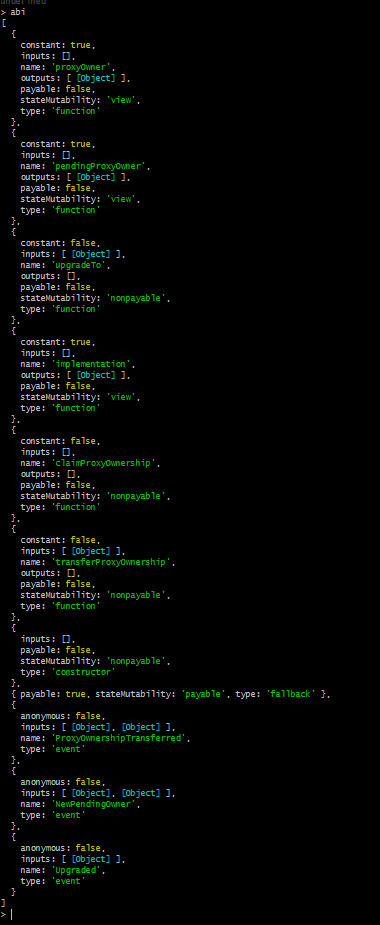

As expected, nothing of "transfer" or "balanceOf". So, what can we do now?

N ° 6 The first thing that catches our attention is that it is a contract that has already undergone an update. Its address number strangely and inexplicably has at the beginning sequence of [11 zeros!](https://etherscan.io/address/0x0000000000085d4780b73119b644ae5ecd22b376#code) How did they achieve such eccentricity?

It was used a special application to calculate "[vanity addresses](https://github.com/MyEtherWallet/VanityEth)" that what they do is to generate as in a mining software, multiple private keys for externally controlled addresses (EOA) in order to deploy a contract several times, until the contract address deployed had the amount of zeros that the algorithm can afford or the user is willing to wait for them to be generated. This was carried out by the [Trust-Token](https://www.trusttoken.com/) company in order to grant an extra security feature to its contracts.

On the other hand, the contract does not have the name "True-USD", which was in the past! Now it is called: "OwnedUpgradeabilityProxy" and is the sequence of several code blocks in the form of abstract contracts inherited one after another, until the compilable contract  has the presence of a function without any name, known as [FALLBACK-FUNCTION](https://solidity.readthedocs.io/en/v0.4.23/contracts.html#fallback-function): a function that must be of external access and with no arguments!

According to the solidity documentation:

>"A contract can have exactly one unnamed function. This function cannot have arguments and cannot return anything. It is executed on a call to the contract if none of the other functions *MATCH* the given function identifier (or if no data was supplied at all). "

The repository continues:

>"Furthermore, this function is executed whenever the contract receives plain Ether (without data). Additionally, in order to receive Ether, the fallback function must be marked as **_payable_**. If no such function exists, the contract cannot receive Ether through regular transactions."

But the curious things about this function are the instructions that it orders within its internal description:

```js
function() external payable {
        address _impl = implementation();
        require(_impl != address(0), "implementation contract not set");
        
        assembly {
            let ptr := mload(0x40)
            calldatacopy(ptr, 0, calldatasize)
            let result := delegatecall(gas, _impl, ptr, calldatasize, 0, 0)
            let size := returndatasize
            returndatacopy(ptr, 0, size)

            switch result
            case 0 { revert(ptr, size) }
            default { return(ptr, size) }
        }
    }
```

There is an address type variable called "*implementation*" (_impl) that is only taken into account if it is non-zero (that is, if it has been defined) and **is assumed to be another contract** and that executes a series of instructions at "**_assembly_**" level, and what basically does is to take the data that is being instructed to be executed and is executed by means of the **_DELEGATECALL_** [operational command](https://ethervm.io/).

*Assembly* instructions are more or less instructing the following:

 - i.- In a *ptr* variable, the data of the function that is to be executed and stored in the memory is stored *from* the 0x40 position, and the amount of data depend on the number that is retrieved from **_calldatasize_**.
 - ii.- In another variable called *result*, the result of calling the implementation contract and executing the orders that are in ptr **is collected**, but, instead of doing it according to the **_call_** command, **delegatecall** executes everything that it has to do as if the contract that does the things is the invoker, and everything that is written and every state that is changed is done on the invoking contract, and not on the invoked one. This is masterfully explained in the note that [CENTRE](https://medium.com/centre-blog/designing-an-upgradeable-ethereum-contract-3d850f637794) prepared that essentially for this innovative strategy, and that without a doubt is an advance in the state of the art of these financial technologies.

   - The important thing to rescue here is that when a contract invokes the execution of one function of another contract by means of the **delegatecall** command, all the changes of state, everything that is written, every fund that is received, arrives, is written and updated **_in the invoker contract_**, *not in the invoked one*!

   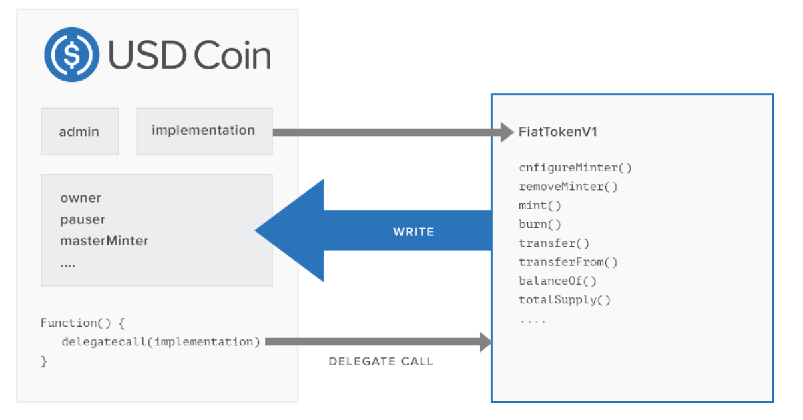

 - iii.- This means that it is not necessary for the unnamed function to return any arguments, since the *returndatacopy* assembly instruction will store in memory everything that needs to be recovered! (So it is unnecessary for the fallback function to explicitly return any argument, since these are housed in the volatile memory of the Ethereum virtual machine and can be rescued through the interface that the user is using).

All this means that if the *implementation* function to be executed is replaced; without anyone even noticing, the logic that will begin to execute the contract will have been updated on, without altering the data or the balance values of any of the users!

**N° 7** So in order to properly execute the [True-USD](https://etherscan.io/address/0x0000000000085d4780b73119b644ae5ecd22b376#code) contract, all we need is to rescue the ABI from the implementation function, unless we want to execute some native control function of the contract in question, such as modifying the contract of implementation or change the contract owner. The value of the address of the implementation contract in the case of Trust-USD is public and [easily fetch able](https://etherscan.io/address/0x0000000000085d4780b73119b644ae5ecd22b376#readContract) as "*implementation*", and its value is `0xcb9a11afdc6bdb92e4a6235959455f28758b34ba`. Therefore, the [ABI](https://etherscan.io/address/0xcb9a11afdc6bdb92e4a6235959455f28758b34ba#code) of the implementation contract is easily salvageable. This time it is much more extensive data:

```cmd
>var abi = [{"constant":true,"inputs":[],"name":"burnMin","outputs":[{"name":"","type":"uint256"}],"payable":false,"stateMutability":"view","type":"function"},{"constant":true,"inputs":[],"name":"name","outputs":[{"name":"","type":"string"}],"payable":false,"stateMutability":"pure","type":"function"},{"constant":false,"inputs":[{"name":"_spender","type":"address"},{"name":"_value","type":"uint256"}],"name":"approve","outputs":[{"name":"","type":"bool"}],"payable":false,"stateMutability":"nonpayable","type":"function"},{"constant":true,"inputs":[{"name":"owner","type":"address"},{"name":"spender","type":"address"}],"name":"delegateAllowance","outputs":[{"name":"","type":"uint256"}],"payable":false,"stateMutability":"view","type":"function"},{"constant":true,"inputs":[],"name":"totalSupply","outputs":[{"name":"","type":"uint256"}],"payable":false,"stateMutability":"view","type":"function"},{"constant":false,"inputs":[{"name":"_minimumGasPriceForFutureRefunds","type":"uint256"}],"name":"setMinimumGasPriceForFutureRefunds","outputs":[],"payable":false,"stateMutability":"nonpayable","type":"function"},{"constant":false,"inputs":[{"name":"_from","type":"address"},{"name":"_to","type":"address"},{"name":"_value","type":"uint256"}],"name":"transferFrom","outputs":[{"name":"","type":"bool"}],"payable":false,"stateMutability":"nonpayable","type":"function"},{"constant":false,"inputs":[],"name":"sponsorGas","outputs":[],"payable":false,"stateMutability":"nonpayable","type":"function"},{"constant":false,"inputs":[{"name":"spender","type":"address"},{"name":"value","type":"uint256"},{"name":"origSender","type":"address"}],"name":"delegateApprove","outputs":[{"name":"","type":"bool"}],"payable":false,"stateMutability":"nonpayable","type":"function"},{"constant":false,"inputs":[{"name":"_ownable","type":"address"}],"name":"reclaimContract","outputs":[],"payable":false,"stateMutability":"nonpayable","type":"function"},{"constant":true,"inputs":[],"name":"rounding","outputs":[{"name":"","type":"uint8"}],"payable":false,"stateMutability":"pure","type":"function"},{"constant":true,"inputs":[],"name":"decimals","outputs":[{"name":"","type":"uint8"}],"payable":false,"stateMutability":"pure","type":"function"},{"constant":true,"inputs":[],"name":"minimumGasPriceForFutureRefunds","outputs":[{"name":"","type":"uint256"}],"payable":false,"stateMutability":"view","type":"function"},{"constant":false,"inputs":[{"name":"_to","type":"address"},{"name":"_value","type":"uint256"}],"name":"mint","outputs":[],"payable":false,"stateMutability":"nonpayable","type":"function"},{"constant":false,"inputs":[{"name":"_value","type":"uint256"}],"name":"burn","outputs":[],"payable":false,"stateMutability":"nonpayable","type":"function"},{"constant":true,"inputs":[{"name":"who","type":"address"}],"name":"delegateBalanceOf","outputs":[{"name":"","type":"uint256"}],"payable":false,"stateMutability":"view","type":"function"},{"constant":false,"inputs":[{"name":"from","type":"address"},{"name":"to","type":"address"},{"name":"value","type":"uint256"},{"name":"origSender","type":"address"}],"name":"delegateTransferFrom","outputs":[{"name":"","type":"bool"}],"payable":false,"stateMutability":"nonpayable","type":"function"},{"constant":false,"inputs":[],"name":"claimOwnership","outputs":[],"payable":false,"stateMutability":"nonpayable","type":"function"},{"constant":false,"inputs":[{"name":"_min","type":"uint256"},{"name":"_max","type":"uint256"}],"name":"setBurnBounds","outputs":[],"payable":false,"stateMutability":"nonpayable","type":"function"},{"constant":false,"inputs":[{"name":"spender","type":"address"},{"name":"addedValue","type":"uint256"},{"name":"origSender","type":"address"}],"name":"delegateIncreaseApproval","outputs":[{"name":"","type":"bool"}],"payable":false,"stateMutability":"nonpayable","type":"function"},{"constant":true,"inputs":[],"name":"minimumGasPriceForRefund","outputs":[{"name":"result","type":"uint256"}],"payable":false,"stateMutability":"view","type":"function"},{"constant":true,"inputs":[],"name":"burnMax","outputs":[{"name":"","type":"uint256"}],"payable":false,"stateMutability":"view","type":"function"},{"constant":true,"inputs":[],"name":"paused","outputs":[{"name":"","type":"bool"}],"payable":false,"stateMutability":"pure","type":"function"},{"constant":false,"inputs":[{"name":"_spender","type":"address"},{"name":"_subtractedValue","type":"uint256"}],"name":"decreaseApproval","outputs":[{"name":"","type":"bool"}],"payable":false,"stateMutability":"nonpayable","type":"function"},{"constant":true,"inputs":[{"name":"_who","type":"address"}],"name":"balanceOf","outputs":[{"name":"","type":"uint256"}],"payable":false,"stateMutability":"view","type":"function"},{"constant":true,"inputs":[],"name":"delegateTotalSupply","outputs":[{"name":"","type":"uint256"}],"payable":false,"stateMutability":"view","type":"function"},{"constant":true,"inputs":[],"name":"registry","outputs":[{"name":"","type":"address"}],"payable":false,"stateMutability":"view","type":"function"},{"constant":true,"inputs":[],"name":"remainingGasRefundPool","outputs":[{"name":"length","type":"uint256"}],"payable":false,"stateMutability":"view","type":"function"},{"constant":false,"inputs":[{"name":"token","type":"address"},{"name":"_to","type":"address"}],"name":"reclaimToken","outputs":[],"payable":false,"stateMutability":"nonpayable","type":"function"},{"constant":true,"inputs":[],"name":"owner","outputs":[{"name":"","type":"address"}],"payable":false,"stateMutability":"view","type":"function"},{"constant":false,"inputs":[{"name":"spender","type":"address"},{"name":"subtractedValue","type":"uint256"},{"name":"origSender","type":"address"}],"name":"delegateDecreaseApproval","outputs":[{"name":"","type":"bool"}],"payable":false,"stateMutability":"nonpayable","type":"function"},{"constant":true,"inputs":[],"name":"symbol","outputs":[{"name":"","type":"string"}],"payable":false,"stateMutability":"pure","type":"function"},{"constant":false,"inputs":[{"name":"_to","type":"address"}],"name":"reclaimEther","outputs":[],"payable":false,"stateMutability":"nonpayable","type":"function"},{"constant":false,"inputs":[{"name":"to","type":"address"},{"name":"value","type":"uint256"},{"name":"origSender","type":"address"}],"name":"delegateTransfer","outputs":[{"name":"","type":"bool"}],"payable":false,"stateMutability":"nonpayable","type":"function"},{"constant":false,"inputs":[{"name":"_to","type":"address"},{"name":"_value","type":"uint256"}],"name":"transfer","outputs":[{"name":"","type":"bool"}],"payable":false,"stateMutability":"nonpayable","type":"function"},{"constant":false,"inputs":[{"name":"_registry","type":"address"}],"name":"setRegistry","outputs":[],"payable":false,"stateMutability":"nonpayable","type":"function"},{"constant":false,"inputs":[{"name":"_account","type":"address"}],"name":"wipeBlacklistedAccount","outputs":[],"payable":false,"stateMutability":"nonpayable","type":"function"},{"constant":false,"inputs":[],"name":"sponsorGas2","outputs":[],"payable":false,"stateMutability":"nonpayable","type":"function"},{"constant":false,"inputs":[{"name":"_spender","type":"address"},{"name":"_addedValue","type":"uint256"}],"name":"increaseApproval","outputs":[{"name":"","type":"bool"}],"payable":false,"stateMutability":"nonpayable","type":"function"},{"constant":true,"inputs":[{"name":"_who","type":"address"},{"name":"_spender","type":"address"}],"name":"allowance","outputs":[{"name":"","type":"uint256"}],"payable":false,"stateMutability":"view","type":"function"},{"constant":true,"inputs":[],"name":"pendingOwner","outputs":[{"name":"","type":"address"}],"payable":false,"stateMutability":"view","type":"function"},{"constant":true,"inputs":[{"name":"_index","type":"uint256"}],"name":"gasRefundPool","outputs":[{"name":"gasPrice","type":"uint256"}],"payable":false,"stateMutability":"view","type":"function"},{"constant":false,"inputs":[{"name":"newOwner","type":"address"}],"name":"transferOwnership","outputs":[],"payable":false,"stateMutability":"nonpayable","type":"function"},{"constant":false,"inputs":[{"name":"_who","type":"address"},{"name":"_attribute","type":"bytes32"},{"name":"_value","type":"uint256"}],"name":"syncAttributeValue","outputs":[],"payable":false,"stateMutability":"nonpayable","type":"function"},{"anonymous":false,"inputs":[{"indexed":true,"name":"account","type":"address"},{"indexed":false,"name":"balance","type":"uint256"}],"name":"WipeBlacklistedAccount","type":"event"},{"anonymous":false,"inputs":[{"indexed":true,"name":"registry","type":"address"}],"name":"SetRegistry","type":"event"},{"anonymous":false,"inputs":[{"indexed":false,"name":"newMin","type":"uint256"},{"indexed":false,"name":"newMax","type":"uint256"}],"name":"SetBurnBounds","type":"event"},{"anonymous":false,"inputs":[{"indexed":true,"name":"burner","type":"address"},{"indexed":false,"name":"value","type":"uint256"}],"name":"Burn","type":"event"},{"anonymous":false,"inputs":[{"indexed":true,"name":"to","type":"address"},{"indexed":false,"name":"value","type":"uint256"}],"name":"Mint","type":"event"},{"anonymous":false,"inputs":[{"indexed":true,"name":"owner","type":"address"},{"indexed":true,"name":"spender","type":"address"},{"indexed":false,"name":"value","type":"uint256"}],"name":"Approval","type":"event"},{"anonymous":false,"inputs":[{"indexed":true,"name":"from","type":"address"},{"indexed":true,"name":"to","type":"address"},{"indexed":false,"name":"value","type":"uint256"}],"name":"Transfer","type":"event"},{"anonymous":false,"inputs":[{"indexed":true,"name":"previousOwner","type":"address"},{"indexed":true,"name":"newOwner","type":"address"}],"name":"OwnershipTransferred","type":"event"}]
undefined 
>_
```
And now by inspecting the ABI we get

```cmd
>abi 
```

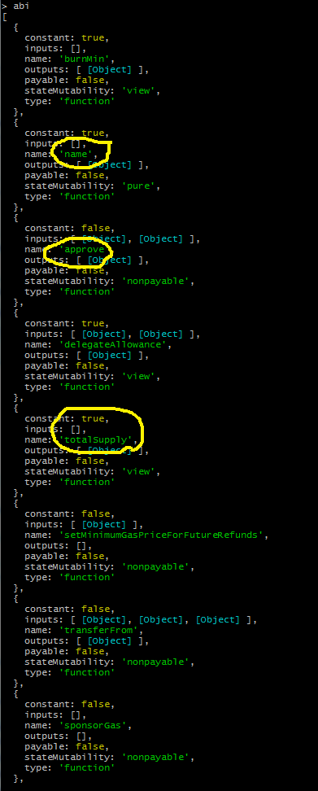	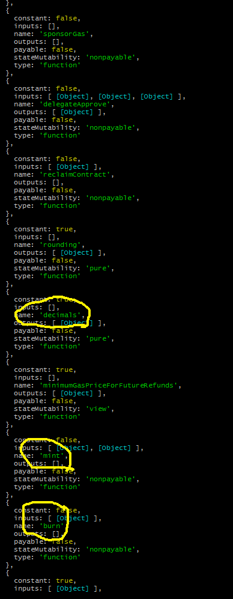

Where the most *common* functions of an ERC20 token are observed.

Now, it is indeed possible to create the appropriate instance of the contract:

```cmd
>var interface = '0xcb9a11afdc6bdb92e4a6235959455f28758b34ba'
undefined 
>var token = '0x0000000000085d4780B73119b644AE5ecd22b376'
undefined 
>var contract = new web3.eth.Contract(abi, token)
undefined 
>_
```

And we can get the *executable* methods from the token through the interface:

```cmd
>contract.methods
```

There is another way of doing this by using [MyEtherWallet](https://www.myetherwallet.com/access-my-wallet) where, when we start the Metamask wallet, we go to the contracts section, we place the token address and in the ABI section, we place the .json data of the implementation contract (taking care of having chosen the correct network , in this case MAIN):


#### Setting the contract parameters (the contract address and the ABI interface):

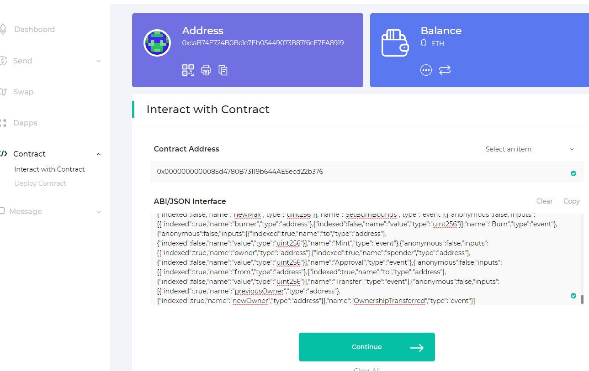


#### Inspecting the function "*name*" (no arguments needed):

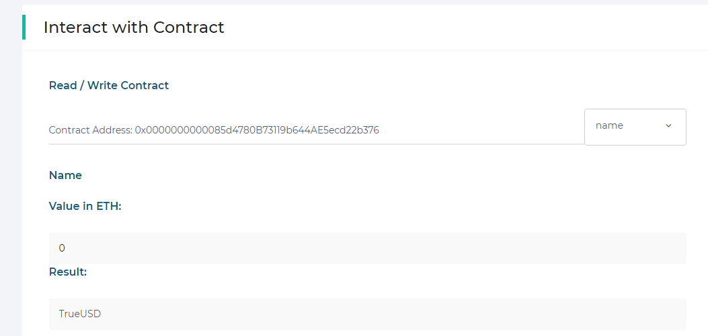


#### Inspecting the function "*totalSupply*" (no arguments needed):

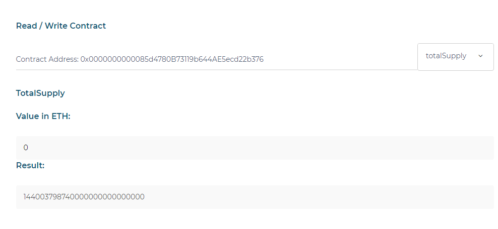


#### Inspecting the function *decimals* (no arguments needed):

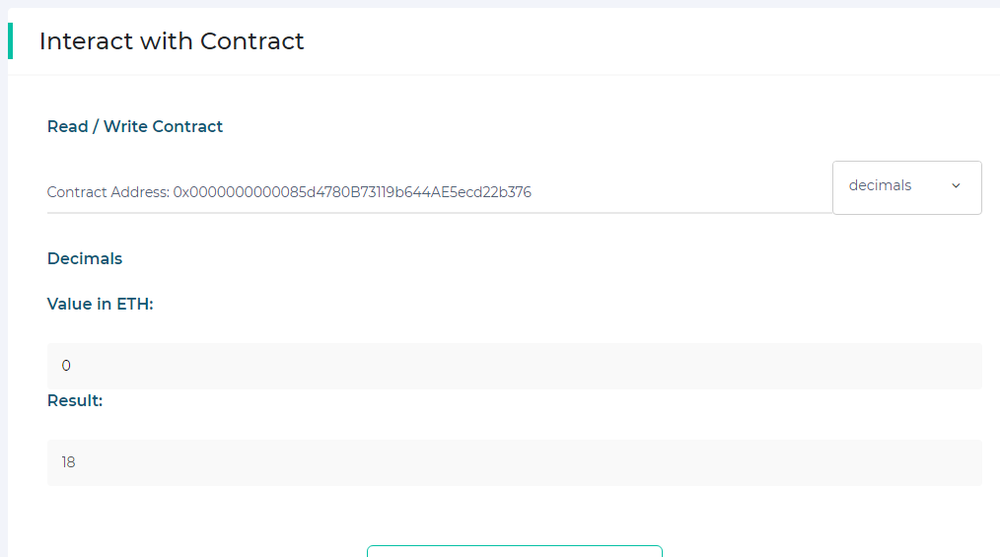


#### Inspecting the function *symbol* (no arguments needed):

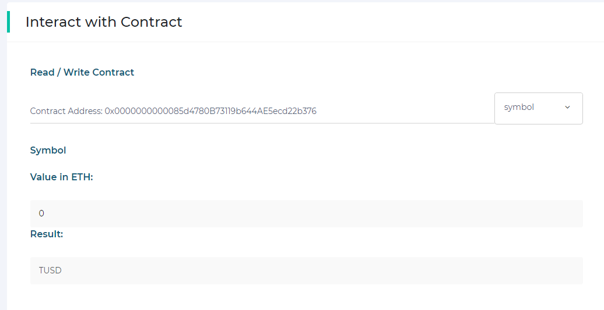


#### Inspecting the function *balanceOf* (with the address `0x8bb38C74B8aaf929201f013C9ECc42b750E562c6` as argument):


From the console, similar methods can be trying:

```cmd
>contract.methods.name().call(function(err, result) { console.log(result) })
Promise { <pending> }
> TrueUSD
```

```cmd
>contract.methods.totalSupply().call(function(err, result) { console.log(result) })
Promise { <pending> }
> 144003798740000000000000000
``` 

The reason for passing the results of *call()* to a function and printing these results on the console is due to the asynchronous nature of web3.eth which JavaScript is able to handle.

```cmd
>contract.methods.decimals().call(function(err, result) { console.log(result) })
Promise { <pending> }
> 18
``` 

```cmd
>contract.methods.symbol().call(function(err, result) { console.log(result) })
Promise { <pending> }
> TUSD
``` 

As an exercise, let us note that if we had used the interface address as the contract address, even though it legitimately has the ABI code that we have executed, we will find that on this contract there is hardly anything written. That is, it has a total Supply of zero, nobody has balances, etc.

```cmd
>var contract = new web3.eth.Contract(abi, interface)
undefined
>contract.methods.totalSupply().call(function(err, result) { console.log(result) })
Promise { <pending> }
> 0
``` 

```cmd
>contract.methods.balanceOf('0x8bb38C74B8aaf929201f013C9ECc42b750E562c6').call(function(err, result) { console.log(result) })
Promise { <pending> }
> 0
``` 

**N° 8** Before closing the interesting case of Trust-Coin, it should be said that these entrepreneurs were pioneers in the strategy of updating the platform. His first plan was primitive, and was to copy the data to a new contract, as the tokens were mobilized. This strategy had many inconveniences, and was migrated to the actual one. In this way a "[Legacy](https://etherscan.io/address/0x8dd5fbCe2F6a956C3022bA3663759011Dd51e73E#code)" contract remains for posterity, against which even today and indefinitely, token transactions can continue to be carried out completely normally, with the exception that today it invokes the "*OwnedUpgradeabilityProxy*" contract.

If we repeat the previous exercises with legacy we will find that this contract retains its data as a perfect mirror of the official active contract data:

```cmd
>var legacy = '0x8dd5fbCe2F6a956C3022bA3663759011Dd51e73E'
undefined
>_
``` 

Of course, ABI data must be replaced by the corresponding to the original Trust-USD contract:

```cmd
>var abi = [{"constant":true,"inputs":[],"name":"burnMin","outputs":[{"name":"","type":"uint256"}],"payable":false,"stateMutability":"view","type":"function"},{"constant":true,"inputs":[],"name":"name","outputs":[{"name":"","type":"string"}],"payable":false,"stateMutability":"view","type":"function"},{"constant":false,"inputs":[{"name":"spender","type":"address"},{"name":"value","type":"uint256"}],"name":"approve","outputs":[{"name":"","type":"bool"}],"payable":false,"stateMutability":"nonpayable","type":"function"},{"constant":true,"inputs":[{"name":"owner","type":"address"},{"name":"spender","type":"address"}],"name":"delegateAllowance","outputs":[{"name":"","type":"uint256"}],"payable":false,"stateMutability":"view","type":"function"},{"constant":true,"inputs":[],"name":"burnFeeFlat","outputs":[{"name":"","type":"uint256"}],"payable":false,"stateMutability":"view","type":"function"},{"constant":false,"inputs":[{"name":"_canReceiveMintWhiteList","type":"address"},{"name":"_canBurnWhiteList","type":"address"},{"name":"_blackList","type":"address"},{"name":"_noFeesList","type":"address"}],"name":"setLists","outputs":[],"payable":false,"stateMutability":"nonpayable","type":"function"},{"constant":false,"inputs":[{"name":"token","type":"address"}],"name":"reclaimToken","outputs":[],"payable":false,"stateMutability":"nonpayable","type":"function"},{"constant":true,"inputs":[],"name":"totalSupply","outputs":[{"name":"","type":"uint256"}],"payable":false,"stateMutability":"view","type":"function"},{"constant":false,"inputs":[{"name":"newContract","type":"address"}],"name":"delegateToNewContract","outputs":[],"payable":false,"stateMutability":"nonpayable","type":"function"},{"constant":false,"inputs":[{"name":"_transferFeeNumerator","type":"uint80"},{"name":"_transferFeeDenominator","type":"uint80"},{"name":"_mintFeeNumerator","type":"uint80"},{"name":"_mintFeeDenominator","type":"uint80"},{"name":"_mintFeeFlat","type":"uint256"},{"name":"_burnFeeNumerator","type":"uint80"},{"name":"_burnFeeDenominator","type":"uint80"},{"name":"_burnFeeFlat","type":"uint256"}],"name":"changeStakingFees","outputs":[],"payable":false,"stateMutability":"nonpayable","type":"function"},{"constant":true,"inputs":[],"name":"canReceiveMintWhiteList","outputs":[{"name":"","type":"address"}],"payable":false,"stateMutability":"view","type":"function"},{"constant":false,"inputs":[{"name":"from","type":"address"},{"name":"to","type":"address"},{"name":"value","type":"uint256"}],"name":"transferFrom","outputs":[{"name":"","type":"bool"}],"payable":false,"stateMutability":"nonpayable","type":"function"},{"constant":true,"inputs":[],"name":"delegatedFrom","outputs":[{"name":"","type":"address"}],"payable":false,"stateMutability":"view","type":"function"},{"constant":false,"inputs":[{"name":"spender","type":"address"},{"name":"value","type":"uint256"},{"name":"origSender","type":"address"}],"name":"delegateApprove","outputs":[{"name":"","type":"bool"}],"payable":false,"stateMutability":"nonpayable","type":"function"},{"constant":false,"inputs":[{"name":"contractAddr","type":"address"}],"name":"reclaimContract","outputs":[],"payable":false,"stateMutability":"nonpayable","type":"function"},{"constant":true,"inputs":[],"name":"decimals","outputs":[{"name":"","type":"uint8"}],"payable":false,"stateMutability":"view","type":"function"},{"constant":true,"inputs":[],"name":"allowances","outputs":[{"name":"","type":"address"}],"payable":false,"stateMutability":"view","type":"function"},{"constant":false,"inputs":[],"name":"unpause","outputs":[],"payable":false,"stateMutability":"nonpayable","type":"function"},{"constant":false,"inputs":[{"name":"_to","type":"address"},{"name":"_amount","type":"uint256"}],"name":"mint","outputs":[],"payable":false,"stateMutability":"nonpayable","type":"function"},{"constant":false,"inputs":[{"name":"_value","type":"uint256"}],"name":"burn","outputs":[],"payable":false,"stateMutability":"nonpayable","type":"function"},{"constant":true,"inputs":[{"name":"who","type":"address"}],"name":"delegateBalanceOf","outputs":[{"name":"","type":"uint256"}],"payable":false,"stateMutability":"view","type":"function"},{"constant":false,"inputs":[{"name":"from","type":"address"},{"name":"to","type":"address"},{"name":"value","type":"uint256"},{"name":"origSender","type":"address"}],"name":"delegateTransferFrom","outputs":[{"name":"","type":"bool"}],"payable":false,"stateMutability":"nonpayable","type":"function"},{"constant":false,"inputs":[],"name":"claimOwnership","outputs":[],"payable":false,"stateMutability":"nonpayable","type":"function"},{"constant":false,"inputs":[{"name":"sheet","type":"address"}],"name":"setBalanceSheet","outputs":[],"payable":false,"stateMutability":"nonpayable","type":"function"},{"constant":false,"inputs":[{"name":"spender","type":"address"},{"name":"addedValue","type":"uint256"},{"name":"origSender","type":"address"}],"name":"delegateIncreaseApproval","outputs":[{"name":"","type":"bool"}],"payable":false,"stateMutability":"nonpayable","type":"function"},{"constant":true,"inputs":[],"name":"burnFeeNumerator","outputs":[{"name":"","type":"uint80"}],"payable":false,"stateMutability":"view","type":"function"},{"constant":true,"inputs":[],"name":"canBurnWhiteList","outputs":[{"name":"","type":"address"}],"payable":false,"stateMutability":"view","type":"function"},{"constant":true,"inputs":[],"name":"burnMax","outputs":[{"name":"","type":"uint256"}],"payable":false,"stateMutability":"view","type":"function"},{"constant":true,"inputs":[],"name":"paused","outputs":[{"name":"","type":"bool"}],"payable":false,"stateMutability":"view","type":"function"},{"constant":true,"inputs":[],"name":"mintFeeDenominator","outputs":[{"name":"","type":"uint80"}],"payable":false,"stateMutability":"view","type":"function"},{"constant":true,"inputs":[],"name":"staker","outputs":[{"name":"","type":"address"}],"payable":false,"stateMutability":"view","type":"function"},{"constant":false,"inputs":[{"name":"addr","type":"address"}],"name":"setDelegatedFrom","outputs":[],"payable":false,"stateMutability":"nonpayable","type":"function"},{"constant":false,"inputs":[{"name":"spender","type":"address"},{"name":"subtractedValue","type":"uint256"}],"name":"decreaseApproval","outputs":[{"name":"","type":"bool"}],"payable":false,"stateMutability":"nonpayable","type":"function"},{"constant":true,"inputs":[],"name":"noFeesList","outputs":[{"name":"","type":"address"}],"payable":false,"stateMutability":"view","type":"function"},{"constant":true,"inputs":[{"name":"who","type":"address"}],"name":"balanceOf","outputs":[{"name":"","type":"uint256"}],"payable":false,"stateMutability":"view","type":"function"},{"constant":false,"inputs":[{"name":"newMin","type":"uint256"},{"name":"newMax","type":"uint256"}],"name":"changeBurnBounds","outputs":[],"payable":false,"stateMutability":"nonpayable","type":"function"},{"constant":true,"inputs":[],"name":"delegateTotalSupply","outputs":[{"name":"","type":"uint256"}],"payable":false,"stateMutability":"view","type":"function"},{"constant":true,"inputs":[],"name":"balances","outputs":[{"name":"","type":"address"}],"payable":false,"stateMutability":"view","type":"function"},{"constant":false,"inputs":[],"name":"pause","outputs":[],"payable":false,"stateMutability":"nonpayable","type":"function"},{"constant":false,"inputs":[{"name":"_name","type":"string"},{"name":"_symbol","type":"string"}],"name":"changeName","outputs":[],"payable":false,"stateMutability":"nonpayable","type":"function"},{"constant":true,"inputs":[],"name":"mintFeeNumerator","outputs":[{"name":"","type":"uint80"}],"payable":false,"stateMutability":"view","type":"function"},{"constant":true,"inputs":[],"name":"owner","outputs":[{"name":"","type":"address"}],"payable":false,"stateMutability":"view","type":"function"},{"constant":true,"inputs":[],"name":"transferFeeNumerator","outputs":[{"name":"","type":"uint80"}],"payable":false,"stateMutability":"view","type":"function"},{"constant":false,"inputs":[{"name":"spender","type":"address"},{"name":"subtractedValue","type":"uint256"},{"name":"origSender","type":"address"}],"name":"delegateDecreaseApproval","outputs":[{"name":"","type":"bool"}],"payable":false,"stateMutability":"nonpayable","type":"function"},{"constant":true,"inputs":[],"name":"symbol","outputs":[{"name":"","type":"string"}],"payable":false,"stateMutability":"view","type":"function"},{"constant":false,"inputs":[{"name":"to","type":"address"},{"name":"value","type":"uint256"},{"name":"origSender","type":"address"}],"name":"delegateTransfer","outputs":[{"name":"","type":"bool"}],"payable":false,"stateMutability":"nonpayable","type":"function"},{"constant":false,"inputs":[],"name":"reclaimEther","outputs":[],"payable":false,"stateMutability":"nonpayable","type":"function"},{"constant":false,"inputs":[{"name":"to","type":"address"},{"name":"value","type":"uint256"}],"name":"transfer","outputs":[{"name":"","type":"bool"}],"payable":false,"stateMutability":"nonpayable","type":"function"},{"constant":false,"inputs":[{"name":"newStaker","type":"address"}],"name":"changeStaker","outputs":[],"payable":false,"stateMutability":"nonpayable","type":"function"},{"constant":false,"inputs":[{"name":"account","type":"address"}],"name":"wipeBlacklistedAccount","outputs":[],"payable":false,"stateMutability":"nonpayable","type":"function"},{"constant":false,"inputs":[{"name":"from_","type":"address"},{"name":"value_","type":"uint256"},{"name":"data_","type":"bytes"}],"name":"tokenFallback","outputs":[],"payable":false,"stateMutability":"nonpayable","type":"function"},{"constant":true,"inputs":[],"name":"burnFeeDenominator","outputs":[{"name":"","type":"uint80"}],"payable":false,"stateMutability":"view","type":"function"},{"constant":true,"inputs":[],"name":"delegate","outputs":[{"name":"","type":"address"}],"payable":false,"stateMutability":"view","type":"function"},{"constant":true,"inputs":[],"name":"blackList","outputs":[{"name":"","type":"address"}],"payable":false,"stateMutability":"view","type":"function"},{"constant":true,"inputs":[],"name":"transferFeeDenominator","outputs":[{"name":"","type":"uint80"}],"payable":false,"stateMutability":"view","type":"function"},{"constant":true,"inputs":[],"name":"mintFeeFlat","outputs":[{"name":"","type":"uint256"}],"payable":false,"stateMutability":"view","type":"function"},{"constant":false,"inputs":[{"name":"spender","type":"address"},{"name":"addedValue","type":"uint256"}],"name":"increaseApproval","outputs":[{"name":"","type":"bool"}],"payable":false,"stateMutability":"nonpayable","type":"function"},{"constant":true,"inputs":[{"name":"_owner","type":"address"},{"name":"spender","type":"address"}],"name":"allowance","outputs":[{"name":"","type":"uint256"}],"payable":false,"stateMutability":"view","type":"function"},{"constant":true,"inputs":[],"name":"pendingOwner","outputs":[{"name":"","type":"address"}],"payable":false,"stateMutability":"view","type":"function"},{"constant":false,"inputs":[{"name":"sheet","type":"address"}],"name":"setAllowanceSheet","outputs":[],"payable":false,"stateMutability":"nonpayable","type":"function"},{"constant":false,"inputs":[{"name":"newOwner","type":"address"}],"name":"transferOwnership","outputs":[],"payable":false,"stateMutability":"nonpayable","type":"function"},{"inputs":[],"payable":false,"stateMutability":"nonpayable","type":"constructor"},{"payable":false,"stateMutability":"nonpayable","type":"fallback"},{"anonymous":false,"inputs":[{"indexed":false,"name":"newMin","type":"uint256"},{"indexed":false,"name":"newMax","type":"uint256"}],"name":"ChangeBurnBoundsEvent","type":"event"},{"anonymous":false,"inputs":[{"indexed":true,"name":"to","type":"address"},{"indexed":false,"name":"amount","type":"uint256"}],"name":"Mint","type":"event"},{"anonymous":false,"inputs":[{"indexed":true,"name":"account","type":"address"},{"indexed":false,"name":"balance","type":"uint256"}],"name":"WipedAccount","type":"event"},{"anonymous":false,"inputs":[{"indexed":true,"name":"newContract","type":"address"}],"name":"DelegatedTo","type":"event"},{"anonymous":false,"inputs":[{"indexed":true,"name":"burner","type":"address"},{"indexed":false,"name":"value","type":"uint256"}],"name":"Burn","type":"event"},{"anonymous":false,"inputs":[],"name":"Pause","type":"event"},{"anonymous":false,"inputs":[],"name":"Unpause","type":"event"},{"anonymous":false,"inputs":[{"indexed":true,"name":"previousOwner","type":"address"},{"indexed":true,"name":"newOwner","type":"address"}],"name":"OwnershipTransferred","type":"event"},{"anonymous":false,"inputs":[{"indexed":true,"name":"owner","type":"address"},{"indexed":true,"name":"spender","type":"address"},{"indexed":false,"name":"value","type":"uint256"}],"name":"Approval","type":"event"},{"anonymous":false,"inputs":[{"indexed":true,"name":"from","type":"address"},{"indexed":true,"name":"to","type":"address"},{"indexed":false,"name":"value","type":"uint256"}],"name":"Transfer","type":"event"}]
undefined
>_
``` 

```cmd
>var contract = new web3.eth.Contract(abi, interface)
undefined
>contract.methods.totalSupply().call(function(err, result) { console.log(result) })
Promise { <pending> }
> 144003798740000000000000000
```

According to Etherscan, the Binance exchange has the following balance by the time this query is made:

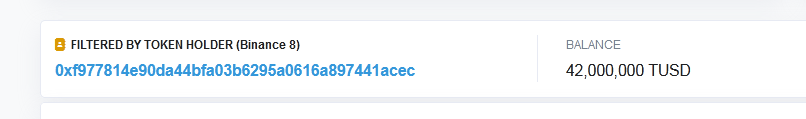

According the **_balanceOf_** method of the legacy contract:

```cmd
>contract.methods.balanceOf('0xF977814e90dA44bFA03b6295A0616a897441aceC').call(function(err, result) { console.log(result) })
Promise { <pending> }
> 42000000000000000000000000
``` 

### II.- The [USD-Coin](https://etherscan.io/address/0xa0b86991c6218b36c1d19d4a2e9eb0ce3606eb48#code) Case

Let's move on to a much more evolved strategy case for upgradeability: The case of [Circle](https://www.circle.com/en/usdc)/[Centre](https://www.centre.io/) team. This team of developers had already learned the hard lessons of their predecessors and built a much simpler, more compact and versatile contract.

```cmd
>var token = '0xA0b86991c6218b36c1d19D4a2e9Eb0cE3606eB48'
undefined 
>_
```

But this time, to discover the ABI we need the interface, which this team had the cunning to keep "*internal*", a private variable. Although certainly nothing in the Ethereum blockchain is hidden, there are ways to complicate the lives of upstarts and curious.

In this case, the contract that invokes the USD-Coin token is called "FiatTokenProxy", and its "*Fallback-Function*" makes an indirect call to an internal (private) function that is the one that contains the assembly code, with a little better efficiency design (thanks also to the [OpenZeppelin](https://github.com/OpenZeppelin/openzeppelin-labs/blob/master/initializer_contracts_with_args/contracts/Proxy.sol) developers) and containing the following:

```js
  function () payable external {
    _fallback();
  }
  
  function _fallback() internal {
    _willFallback();
    _delegate(_implementation());
  }
  
  function _willFallback() internal {
  }
  
  function _implementation() internal view returns (address impl) {
    bytes32 slot = IMPLEMENTATION_SLOT;
    assembly {
      impl := sload(slot)
    }
  }

  function _delegate(address implementation) internal {
    assembly {
      // Copy msg.data. We take full control of memory in this inline assembly
      // block because it will not return to Solidity code. We overwrite the
      // Solidity scratch pad at memory position 0.
      calldatacopy(0, 0, calldatasize)

      // Call the implementation.
      // out and outsize are 0 because we don't know the size yet.
      let result := delegatecall(gas, implementation, 0, calldatasize, 0, 0)

      // Copy the returned data.
      returndatacopy(0, 0, returndatasize)

      switch result
      case 0 { revert(0, returndatasize) }
      default { return(0, returndatasize) }
    }
  }
```

This essentially does the same as in the case of Trust-Token. Fortunately the value of the address of the implementation contract was invoked in the contract construction function and it must be admitted, that they could have complicated things a lot more for the curious newbie's. This implementation address is:


```cmd
>var implementation = '0x0882477e7895bdc5cea7cb1552ed914ab157fe56'
undefined 
>_
```

Not only that: the Centre team was kind enough to verify the implementation contract, and its ABI is:

```cmd
>var abi = [{"constant":true,"inputs":[],"name":"name","outputs":[{"name":"","type":"string"}],"payable":false,"stateMutability":"view","type":"function"},{"constant":false,"inputs":[{"name":"_spender","type":"address"},{"name":"_value","type":"uint256"}],"name":"approve","outputs":[{"name":"","type":"bool"}],"payable":false,"stateMutability":"nonpayable","type":"function"},{"constant":true,"inputs":[],"name":"totalSupply","outputs":[{"name":"","type":"uint256"}],"payable":false,"stateMutability":"view","type":"function"},{"constant":false,"inputs":[{"name":"_account","type":"address"}],"name":"unBlacklist","outputs":[],"payable":false,"stateMutability":"nonpayable","type":"function"},{"constant":false,"inputs":[{"name":"_from","type":"address"},{"name":"_to","type":"address"},{"name":"_value","type":"uint256"}],"name":"transferFrom","outputs":[{"name":"","type":"bool"}],"payable":false,"stateMutability":"nonpayable","type":"function"},{"constant":false,"inputs":[{"name":"minter","type":"address"}],"name":"removeMinter","outputs":[{"name":"","type":"bool"}],"payable":false,"stateMutability":"nonpayable","type":"function"},{"constant":true,"inputs":[],"name":"decimals","outputs":[{"name":"","type":"uint8"}],"payable":false,"stateMutability":"view","type":"function"},{"constant":false,"inputs":[{"name":"_name","type":"string"},{"name":"_symbol","type":"string"},{"name":"_currency","type":"string"},{"name":"_decimals","type":"uint8"},{"name":"_masterMinter","type":"address"},{"name":"_pauser","type":"address"},{"name":"_blacklister","type":"address"},{"name":"_owner","type":"address"}],"name":"initialize","outputs":[],"payable":false,"stateMutability":"nonpayable","type":"function"},{"constant":true,"inputs":[],"name":"masterMinter","outputs":[{"name":"","type":"address"}],"payable":false,"stateMutability":"view","type":"function"},{"constant":false,"inputs":[],"name":"unpause","outputs":[],"payable":false,"stateMutability":"nonpayable","type":"function"},{"constant":false,"inputs":[{"name":"_to","type":"address"},{"name":"_amount","type":"uint256"}],"name":"mint","outputs":[{"name":"","type":"bool"}],"payable":false,"stateMutability":"nonpayable","type":"function"},{"constant":false,"inputs":[{"name":"_amount","type":"uint256"}],"name":"burn","outputs":[],"payable":false,"stateMutability":"nonpayable","type":"function"},{"constant":false,"inputs":[{"name":"minter","type":"address"},{"name":"minterAllowedAmount","type":"uint256"}],"name":"configureMinter","outputs":[{"name":"","type":"bool"}],"payable":false,"stateMutability":"nonpayable","type":"function"},{"constant":false,"inputs":[{"name":"_newPauser","type":"address"}],"name":"updatePauser","outputs":[],"payable":false,"stateMutability":"nonpayable","type":"function"},{"constant":true,"inputs":[],"name":"paused","outputs":[{"name":"","type":"bool"}],"payable":false,"stateMutability":"view","type":"function"},{"constant":true,"inputs":[{"name":"account","type":"address"}],"name":"balanceOf","outputs":[{"name":"","type":"uint256"}],"payable":false,"stateMutability":"view","type":"function"},{"constant":false,"inputs":[],"name":"pause","outputs":[],"payable":false,"stateMutability":"nonpayable","type":"function"},{"constant":true,"inputs":[{"name":"minter","type":"address"}],"name":"minterAllowance","outputs":[{"name":"","type":"uint256"}],"payable":false,"stateMutability":"view","type":"function"},{"constant":true,"inputs":[],"name":"owner","outputs":[{"name":"","type":"address"}],"payable":false,"stateMutability":"view","type":"function"},{"constant":true,"inputs":[],"name":"symbol","outputs":[{"name":"","type":"string"}],"payable":false,"stateMutability":"view","type":"function"},{"constant":true,"inputs":[],"name":"pauser","outputs":[{"name":"","type":"address"}],"payable":false,"stateMutability":"view","type":"function"},{"constant":false,"inputs":[{"name":"_to","type":"address"},{"name":"_value","type":"uint256"}],"name":"transfer","outputs":[{"name":"","type":"bool"}],"payable":false,"stateMutability":"nonpayable","type":"function"},{"constant":false,"inputs":[{"name":"_newMasterMinter","type":"address"}],"name":"updateMasterMinter","outputs":[],"payable":false,"stateMutability":"nonpayable","type":"function"},{"constant":true,"inputs":[{"name":"account","type":"address"}],"name":"isMinter","outputs":[{"name":"","type":"bool"}],"payable":false,"stateMutability":"view","type":"function"},{"constant":false,"inputs":[{"name":"_newBlacklister","type":"address"}],"name":"updateBlacklister","outputs":[],"payable":false,"stateMutability":"nonpayable","type":"function"},{"constant":true,"inputs":[],"name":"blacklister","outputs":[{"name":"","type":"address"}],"payable":false,"stateMutability":"view","type":"function"},{"constant":true,"inputs":[{"name":"owner","type":"address"},{"name":"spender","type":"address"}],"name":"allowance","outputs":[{"name":"","type":"uint256"}],"payable":false,"stateMutability":"view","type":"function"},{"constant":true,"inputs":[],"name":"currency","outputs":[{"name":"","type":"string"}],"payable":false,"stateMutability":"view","type":"function"},{"constant":false,"inputs":[{"name":"newOwner","type":"address"}],"name":"transferOwnership","outputs":[],"payable":false,"stateMutability":"nonpayable","type":"function"},{"constant":false,"inputs":[{"name":"_account","type":"address"}],"name":"blacklist","outputs":[],"payable":false,"stateMutability":"nonpayable","type":"function"},{"constant":true,"inputs":[{"name":"_account","type":"address"}],"name":"isBlacklisted","outputs":[{"name":"","type":"bool"}],"payable":false,"stateMutability":"view","type":"function"},{"anonymous":false,"inputs":[{"indexed":true,"name":"minter","type":"address"},{"indexed":true,"name":"to","type":"address"},{"indexed":false,"name":"amount","type":"uint256"}],"name":"Mint","type":"event"},{"anonymous":false,"inputs":[{"indexed":true,"name":"burner","type":"address"},{"indexed":false,"name":"amount","type":"uint256"}],"name":"Burn","type":"event"},{"anonymous":false,"inputs":[{"indexed":true,"name":"minter","type":"address"},{"indexed":false,"name":"minterAllowedAmount","type":"uint256"}],"name":"MinterConfigured","type":"event"},{"anonymous":false,"inputs":[{"indexed":true,"name":"oldMinter","type":"address"}],"name":"MinterRemoved","type":"event"},{"anonymous":false,"inputs":[{"indexed":true,"name":"newMasterMinter","type":"address"}],"name":"MasterMinterChanged","type":"event"},{"anonymous":false,"inputs":[{"indexed":true,"name":"_account","type":"address"}],"name":"Blacklisted","type":"event"},{"anonymous":false,"inputs":[{"indexed":true,"name":"_account","type":"address"}],"name":"UnBlacklisted","type":"event"},{"anonymous":false,"inputs":[{"indexed":true,"name":"newBlacklister","type":"address"}],"name":"BlacklisterChanged","type":"event"},{"anonymous":false,"inputs":[],"name":"Pause","type":"event"},{"anonymous":false,"inputs":[],"name":"Unpause","type":"event"},{"anonymous":false,"inputs":[{"indexed":true,"name":"newAddress","type":"address"}],"name":"PauserChanged","type":"event"},{"anonymous":false,"inputs":[{"indexed":true,"name":"owner","type":"address"},{"indexed":true,"name":"spender","type":"address"},{"indexed":false,"name":"value","type":"uint256"}],"name":"Approval","type":"event"},{"anonymous":false,"inputs":[{"indexed":false,"name":"previousOwner","type":"address"},{"indexed":false,"name":"newOwner","type":"address"}],"name":"OwnershipTransferred","type":"event"},{"anonymous":false,"inputs":[{"indexed":true,"name":"from","type":"address"},{"indexed":true,"name":"to","type":"address"},{"indexed":false,"name":"value","type":"uint256"}],"name":"Transfer","type":"event"}]
undefined 
>_
```

So now we could play with the contract using web3:

```cmd
>var contract = new web3.eth.Contract(abi, token)
undefined 
>contract.methods.name().call(function(err, result) { console.log(result) })
Promise { <pending> }
> USD//C
```

```cmd
>contract.methods.totalSupply().call(function(err, result) { console.log(result) })
Promise { <pending> }
> 444815302970000
```

```cmd
>contract.methods.decimals().call(function(err, result) { console.log(result) })
Promise { <pending> }
> 6
```

```cmd
>contract.methods.balanceOf('0xA910f92ACdAf488fa6eF02174fb86208Ad7722ba').call(function(err, result) { console.log(result) })
Promise { <pending> }
> 8001035943712
```

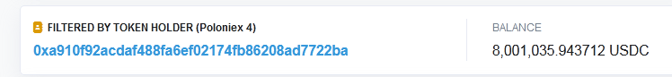

Contrary to the case of Trust Token, the USD-Coin implementation contract is completely empty, it literally serves as a kind of library of the main contract:

```cmd
>var contract = new web3.eth.Contract(abi, implementation)
undefined 
>contract.methods.name().call(function(err, result) { console.log(result) })
Promise { <pending> }
> 
```

```cmd
>contract.methods.totalSupply().call(function(err, result) { console.log(result) })
Promise { <pending> }
> 0
```

```cmd
>contract.methods.decimals().call(function(err, result) { console.log(result) })
Promise { <pending> }
> 0
```

```cmd
>contract.methods.balanceOf('0xA910f92ACdAf488fa6eF02174fb86208Ad7722ba').call(function(err, result) { console.log(result) })
Promise { <pending> }
> 0
```

### III. - The [EURS-Stasis](https://etherscan.io/address/0xdb25f211ab05b1c97d595516f45794528a807ad8#code) Case

We will finally address the case of EURS-Stasis. This contract, which has an update plan with intermediate technology, introduces a great innovation: the transfer with delegation by the means of signatures; which would have the capacity incidentally to solve the inconveniences that implicitly generate the "*approve*" and "*transferFrom*" functions, making them (together with their "*allowances*" mapping) obsolete programming objects in an ERC20 token.

N° 1 **Upgrade Strategy** : In the contract there is a modifier called "*delegatable*", which affects all the important functions of the contract. Likewise, the contract has an unnamed function (*fallback*) that is logically affected by the modifier, in case the contract to which the delegation points out, has functions whose names are new and have not been foreseen in the current contract.

Likewise, the contract has a "**_delegate_**" variable, which is the address of the delegation or the delegated contract. While this variable retains its initial value (which by default is `address (0)`), the unnamed function, if invoked, will always abort its execution; and all the functions of the contract that invoke the modifier, will behave just as the contract in question indicates.

**_delegate_** is an "*internal*" variable, which means that it is not visible to the public, nor is there a direct way to consult it.

The **_delegatable_** modifier has the following instructions:

```js
  modifier delegatable {
    if (delegate == address (0)) {
      require (msg.value == 0); // Non payable if not delegated
      _;
    } else {
      assembly {
        // Save owner
        let oldOwner := sload (owner_slot)

        // Save delegate
        let oldDelegate := sload (delegate_slot)

        // Solidity stores address of the beginning of free memory at 0x40
        let buffer := mload (0x40)

        // Copy message call data into buffer
        calldatacopy (buffer, 0, calldatasize)

        // Lets call our delegate
        let result := delegatecall (gas, oldDelegate, buffer, calldatasize, buffer, 0)

        // Check, whether owner was changed
        switch eq (oldOwner, sload (owner_slot))
        case 1 {} // Owner was not changed, fine
        default {revert (0, 0) } // Owner was changed, revert!

        // Check, whether delegate was changed
        switch eq (oldDelegate, sload (delegate_slot))
        case 1 {} // Delegate was not changed, fine
        default {revert (0, 0) } // Delegate was changed, revert!

        // Copy returned value into buffer
        returndatacopy (buffer, 0, returndatasize)

        // Check call status
        switch result
        case 0 { revert (buffer, returndatasize) } // Call failed, revert!
        default { return (buffer, returndatasize) } // Call succeeded, return
      }
    }
  }

```

Basically what this modifier instructs is that if the value of *delegate* is `address(0)` (AND if, FURTHER, the value of ethers sent to the contract is zero) that the execution of the functions of the contract be continued as indicated in the same contract, but if not, the orders that are instructed in the data will be executed in a delegated manner, against the contract that is in the address *delegate*; but (as indicated in the *switch* loops for *owner* and *delegate*), if in the delegated execution process, any of these parameters was modified, then the entire transaction is ordered to be aborted. Finally (the last *switch* instance) if the delegated execution does not return data, it is understood to be a failed transaction and is ordered to revert.

N° 2 **Current value of _delegate_** : Since it is not possible to make a direct consult on an internal or private variable of a contract, it is necessary to perform a track of all possible events related to the change of this parameter in the contract. Fortunately, the [STASIS](https://stasis.net/) team had the generosity to designate an event associated with the change of this parameter, which will be emitted every time such a thing occurs; the **_Delegation_** event. Other internal parameters when changing does it *silently*, such as the cases of the **_setOwner_** and **_setFeeCollector_** functions. Detecting such silent changes in the blockchain requires listening carefully to the contract, transaction by transaction from the block number in which it was deployed to the most recent. It is an unconventional challenge, and depending on the traffic experienced by that contract, it is an almost impossible challenge manually, unless a special code is developed for it.

How to *listen to* a specific event, issued by a contract and track the occurrence of the changes along the blockchain ?: using a [web3.eth.Contract](https://web3js.readthedocs.io/en/v1.2.4/web3-eth-contract.html#web3-eth-contract) package method, the **_[getPastEvents](https://web3js.readthedocs.io/en/v1.2.4/web3-eth-contract.html#getpastevents)_** method.

Fortunately, there is a simple method to code the execution of this event tracker, using JavaScript through a web page as a user interface, or using the Node.js runtime environment.

In this case, since we have already relied on Node, a small JavaScript code is suggested, to execute it in Node. It is suggested to create a directory for this purpose, for example `C:\Users\MyUser\LocalFolder\Delegate`; In this folder we will create the following JavaScript file (for example `app.js`):

```js
const Web3 = require('web3');
const INFURA_KEY = '<put here the key of your INFURA project>';
const url = 'https://mainnet.infura.io/v3/'+INFURA_KEY;
const web3 = new Web3(url);
const abi = [{"constant":false,"inputs":[],"name":"freezeTransfers","outputs":[],"payable":true,"stateMutability":"payable","type":"function"},{"constant":true,"inputs":[],"name":"name","outputs":[{"name":"","type":"string"}],"payable":false,"stateMutability":"view","type":"function"},{"constant":false,"inputs":[{"name":"_spender","type":"address"},{"name":"_value","type":"uint256"}],"name":"approve","outputs":[{"name":"success","type":"bool"}],"payable":true,"stateMutability":"payable","type":"function"},{"constant":false,"inputs":[{"name":"_newOwner","type":"address"}],"name":"setOwner","outputs":[],"payable":false,"stateMutability":"nonpayable","type":"function"},{"constant":true,"inputs":[],"name":"totalSupply","outputs":[{"name":"","type":"uint256"}],"payable":false,"stateMutability":"view","type":"function"},{"constant":false,"inputs":[{"name":"_from","type":"address"},{"name":"_to","type":"address"},{"name":"_value","type":"uint256"}],"name":"transferFrom","outputs":[{"name":"","type":"bool"}],"payable":true,"stateMutability":"payable","type":"function"},{"constant":true,"inputs":[],"name":"decimals","outputs":[{"name":"","type":"uint8"}],"payable":false,"stateMutability":"view","type":"function"},{"constant":false,"inputs":[],"name":"unfreezeTransfers","outputs":[],"payable":true,"stateMutability":"payable","type":"function"},{"constant":true,"inputs":[],"name":"getFeeParameters","outputs":[{"name":"_fixedFee","type":"uint256"},{"name":"_minVariableFee","type":"uint256"},{"name":"_maxVariableFee","type":"uint256"},{"name":"_variableFeeNumnerator","type":"uint256"}],"payable":false,"stateMutability":"view","type":"function"},{"constant":false,"inputs":[{"name":"_value","type":"uint256"}],"name":"burnTokens","outputs":[{"name":"","type":"bool"}],"payable":true,"stateMutability":"payable","type":"function"},{"constant":true,"inputs":[{"name":"_owner","type":"address"}],"name":"balanceOf","outputs":[{"name":"balance","type":"uint256"}],"payable":false,"stateMutability":"view","type":"function"},{"constant":true,"inputs":[{"name":"_owner","type":"address"}],"name":"nonce","outputs":[{"name":"","type":"uint256"}],"payable":false,"stateMutability":"view","type":"function"},{"constant":false,"inputs":[{"name":"_value","type":"uint256"}],"name":"createTokens","outputs":[{"name":"","type":"bool"}],"payable":true,"stateMutability":"payable","type":"function"},{"constant":true,"inputs":[],"name":"symbol","outputs":[{"name":"","type":"string"}],"payable":false,"stateMutability":"view","type":"function"},{"constant":true,"inputs":[{"name":"_amount","type":"uint256"}],"name":"calculateFee","outputs":[{"name":"_fee","type":"uint256"}],"payable":false,"stateMutability":"view","type":"function"},{"constant":true,"inputs":[{"name":"_address","type":"address"}],"name":"flags","outputs":[{"name":"","type":"uint256"}],"payable":false,"stateMutability":"view","type":"function"},{"constant":false,"inputs":[{"name":"_newFeeCollector","type":"address"}],"name":"setFeeCollector","outputs":[],"payable":true,"stateMutability":"payable","type":"function"},{"constant":false,"inputs":[{"name":"_to","type":"address"},{"name":"_value","type":"uint256"}],"name":"transfer","outputs":[{"name":"","type":"bool"}],"payable":true,"stateMutability":"payable","type":"function"},{"constant":false,"inputs":[{"name":"_address","type":"address"},{"name":"_flags","type":"uint256"}],"name":"setFlags","outputs":[],"payable":true,"stateMutability":"payable","type":"function"},{"constant":false,"inputs":[{"name":"_to","type":"address"},{"name":"_value","type":"uint256"},{"name":"_fee","type":"uint256"},{"name":"_nonce","type":"uint256"},{"name":"_v","type":"uint8"},{"name":"_r","type":"bytes32"},{"name":"_s","type":"bytes32"}],"name":"delegatedTransfer","outputs":[{"name":"","type":"bool"}],"payable":true,"stateMutability":"payable","type":"function"},{"constant":false,"inputs":[{"name":"_delegate","type":"address"}],"name":"setDelegate","outputs":[],"payable":false,"stateMutability":"nonpayable","type":"function"},{"constant":false,"inputs":[{"name":"_fixedFee","type":"uint256"},{"name":"_minVariableFee","type":"uint256"},{"name":"_maxVariableFee","type":"uint256"},{"name":"_variableFeeNumerator","type":"uint256"}],"name":"setFeeParameters","outputs":[],"payable":true,"stateMutability":"payable","type":"function"},{"constant":true,"inputs":[{"name":"_owner","type":"address"},{"name":"_spender","type":"address"}],"name":"allowance","outputs":[{"name":"remaining","type":"uint256"}],"payable":false,"stateMutability":"view","type":"function"},{"inputs":[{"name":"_feeCollector","type":"address"}],"payable":false,"stateMutability":"nonpayable","type":"constructor"},{"payable":true,"stateMutability":"payable","type":"fallback"},{"anonymous":false,"inputs":[],"name":"Freeze","type":"event"},{"anonymous":false,"inputs":[],"name":"Unfreeze","type":"event"},{"anonymous":false,"inputs":[{"indexed":false,"name":"fixedFee","type":"uint256"},{"indexed":false,"name":"minVariableFee","type":"uint256"},{"indexed":false,"name":"maxVariableFee","type":"uint256"},{"indexed":false,"name":"variableFeeNumerator","type":"uint256"}],"name":"FeeChange","type":"event"},{"anonymous":false,"inputs":[{"indexed":false,"name":"delegate","type":"address"}],"name":"Delegation","type":"event"},{"anonymous":false,"inputs":[{"indexed":true,"name":"_from","type":"address"},{"indexed":true,"name":"_to","type":"address"},{"indexed":false,"name":"_value","type":"uint256"}],"name":"Transfer","type":"event"},{"anonymous":false,"inputs":[{"indexed":true,"name":"_owner","type":"address"},{"indexed":true,"name":"_spender","type":"address"},{"indexed":false,"name":"_value","type":"uint256"}],"name":"Approval","type":"event"}];
const EURS = '0xdB25f211AB05b1c97D595516F45794528a807ad8';
const EursToken = new web3.eth.Contract(abi, EURS);
EursToken.getPastEvents(
  'Delegation',
  {
    fromBlock: 5835251,
    toBlock: 'latest'
  },
  (error, event) => { console.log(event) }
)

```

Finally, from the command console we execute:

```cmd
C:\Users\MyUser\LocalFolder\Delegate >node app.js

```

This returns this strange answer:

```cmd
C:\Users\MyUser\LocalFolder\Delegate > 
[]
```

This means that (at least as far of the date on which this inspection was carried out, on January 25, 2020) the answer returns an array that is empty. That is, the function *setDelegate* has never been executed since the day the contract was deployed, even once. It follows that the value of the *delegate* parameter is `address (0)`. Note that the *setDelegate* function can only be executed by the contract owner, due to the instruction: `require (msg.sender == owner);`  that the contract contains on its line 776.

We can be sure that this is an empty array when the case is checked against the parameter that returns the tracking of the *FeeChange* event that is emitted every time the *setFeeParameters* function is executed (also restricted only to the contract owner). For example, if we create a new JavaScript file, for example `fee.js` by changing the last instruction of `app.js` by this other:

```js

EursToken.getPastEvents(
  'FeeChange',
  {
    fromBlock: 5835251,
    toBlock: 'latest'
  },
  (error, event) => { console.log(event) }
)

```

At executing:

```cmd
C:\Users\MyUser\LocalFolder\Delegate >node fee

```

The following answer is obtained:

```js
C:\Users\MyUser\LocalFolder\Delegate > 
[
  {
    address: '0xdB25f211AB05b1c97D595516F45794528a807ad8',
    blockHash: '0xbf9eea602be3959afc5e7cae404dc5d16c10f64f9f7a4b490fb6887cc6fc1edf',
    blockNumber: 5835461,
    logIndex: 83,
    removed: false,
    transactionHash: '0xffafe1e2aae3fd207ca5d15a7aed2f5498b3062f54cefa5fce05e597c8b08407',
    transactionIndex: 158,
    id: 'log_19305eb1',
    returnValues: Result {
      '0': '50',
      '1': '0',
      '2': '0',
      '3': '0',
      fixedFee: '50',
      minVariableFee: '0',
      maxVariableFee: '0',
      variableFeeNumerator: '0'
    },
    event: 'FeeChange',
    signature: '0x650bf5314bb5924368ffebaf7dffcfaa4a0f99c2ab08264c26bf0547f8c459e9',
    raw: {
      data: '0x0000000000000000000000000000000000000000000000000000000000000032000000000000000000000000000000000000000000000000000000000000000000000000000000000000000000000000000000000000000000000000000000000000000000000000000000000000000000000000000000000000000000000000',
      topics: [Array]
    }
  },
  {
    address: '0xdB25f211AB05b1c97D595516F45794528a807ad8',
    blockHash: '0xcd33aaa4fd037ad1c95939b7ac4a4980a11b7a90bf7a11a40ddf3071e2a60ff4',
    blockNumber: 8010430,
    logIndex: 8,
    removed: false,
    transactionHash: '0x427b89f50d289143e1381a225366d1a36f41637a3c8290dd1057fa941fd0d436',
    transactionIndex: 14,
    id: 'log_d07a5910',
    returnValues: Result {
      '0': '0',
      '1': '0',
      '2': '0',
      '3': '0',
      fixedFee: '0',
      minVariableFee: '0',
      maxVariableFee: '0',
      variableFeeNumerator: '0'
    },
    event: 'FeeChange',
    signature: '0x650bf5314bb5924368ffebaf7dffcfaa4a0f99c2ab08264c26bf0547f8c459e9',
    raw: {
      data: '0x0000000000000000000000000000000000000000000000000000000000000000000000000000000000000000000000000000000000000000000000000000000000000000000000000000000000000000000000000000000000000000000000000000000000000000000000000000000000000000000000000000000000000000',
      topics: [Array]
    }
  }
]

```

This indicate us that just 1 hour after the contract was deployed (in block No. `5835461`, on June 22, 2018), commission fees were established for executing delegated transfers. Just one year later (in block N ° `8010430`, on June 22, 2019), the STASIS team makes the decision to set to zero all commissions. How they achieve such a feat, it is already part of a business strategy that is beyond the scope of this analysis.

Note that the transactions that cause the issuance of the *FeeChange* events originate from the invocation of a contract distinct than **EURSToken**: A [**_Wallet_**](https://etherscan.io / address / 0x2ebbbc541e8f8f24386fa319c79ceda0579f1efb # code) contract, which executes a generic transaction: *confirm*; which invokes the value of a map with a pre-image equal to a hash value and the map image is the data of certain transaction (data deleted after the execution), which in turn can call another or other contracts. *Wallet* is a type of contract to handle transactions in an indirect and protected manner, by a group of owners, in such a way to obfuscate the data of such transactions and require the appropriate authorization for each transaction of interest.

10.3 **The Innovation of the Function _delegatedTransfer_**: many times innovation consists of simple changes that had not been taken seriously before, but when implemented, they highlight how relevant they are for the adoption of a technology.

If the intention of using stable coins, is to promote an adoption that somehow breaks the barrier of the network effect, we need the end user to use this technology without requiring advanced knowledge of what is happening within their application. And one of those barriers is the need to pay commissions of *Gas* in ethers, in order to be able to mobilize funds that exist in another totally different currency: euros and dollars!

How do we explain to the ordinary user that those dollars he wishes to send, will not move from his wallet unless he acquires and places in his same "*address*" a sufficient amount of *ethers*? That is, it was not enough to buy the * Tokens * in stable coin (either dollars or euros), another complex process must also be done to acquire a cryptocurrency, which in principle does not interest the user or does not have to interest to him/her at all. And all this just to buy a magazine, a coffee or pay the utility bill.

This is the technological contribution of the function **_delegatedTransfer_** whose mission is to avoid the end user the need to deal with a cryptocurrency, when his field of action is concentrated in a different currency. The STASIS team developed an application, available for mobile phones with [**_Android_**](https://play.google.com/store/apps/details?id=com.stasis.stasiswallet) operating system, as well as [**_iOS_**](https://apps.apple.com/app/stasis-wallet/id1371949230) mobile phones, that allow the user to send to a *delegate* a request to mobilize funds, through a "client-server" communication channel completely appart from the blockchain (a so-called off-chain RPC), in order to carry out the transfer of EURS-token. This request is accompanied by a cryptographic signature [ECDSA](https://en.wikipedia.org/wiki/Elliptic_Curve_Digital_Signature_Algorithm) under the [Ethereum standard](https://ethereum.stackexchange.com/questions/64380/understanding-ethereum -signatures) comprising three parameters: two 32-byte strings called "* R *" and "* S *" and a one-byte extension number, or "* V *" parameter.

Since this topic already deviates from the objective of this analysis of the strategies for updating contracts used by some stable currencies, I give the briefest possible analysis to the _delegatedTransfer_ function:

**i.- How _delegatedTransfer_ works**. The solidity code of this function is:
