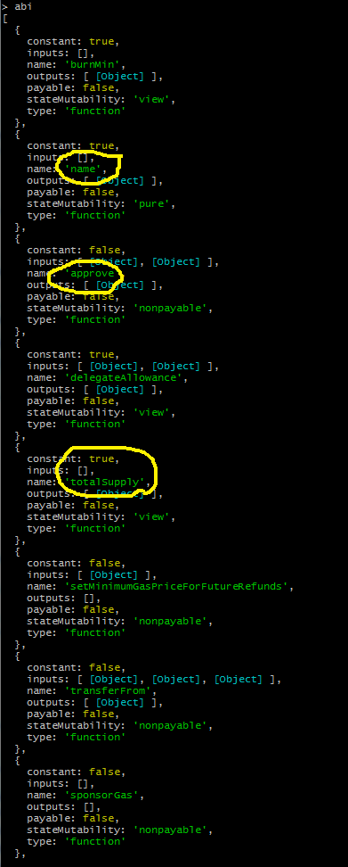
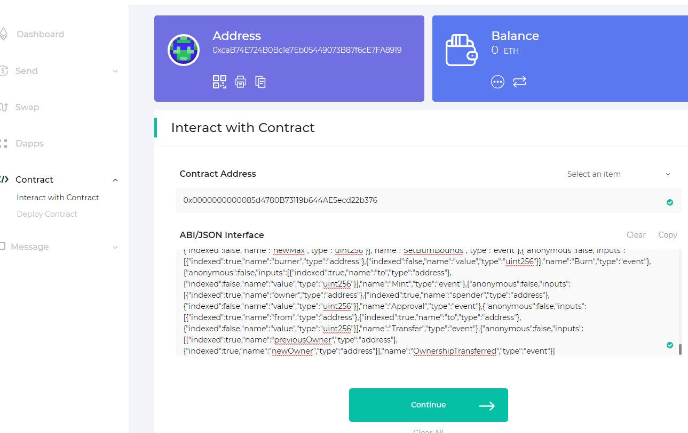
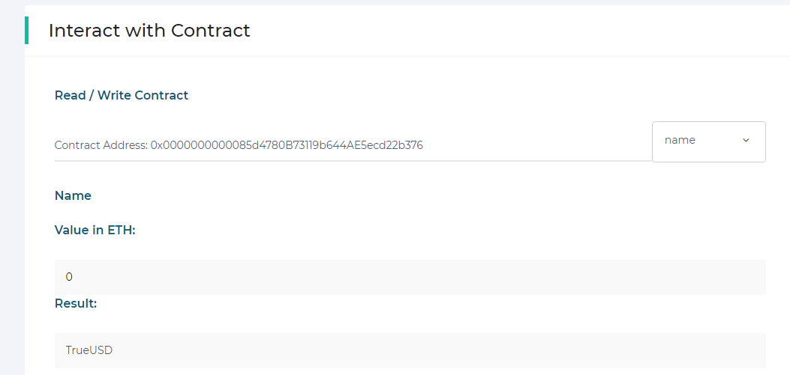
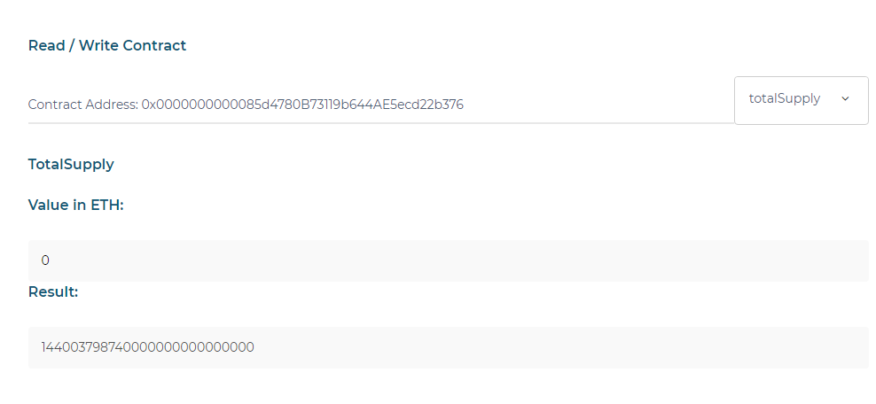
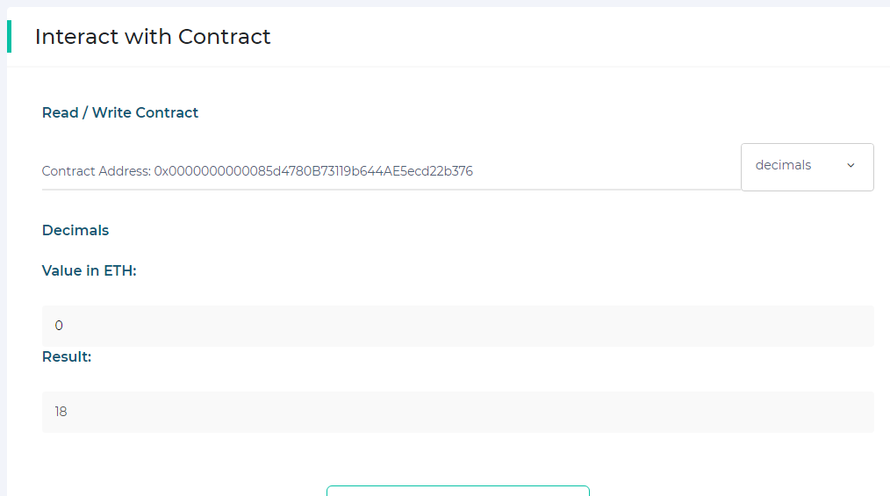
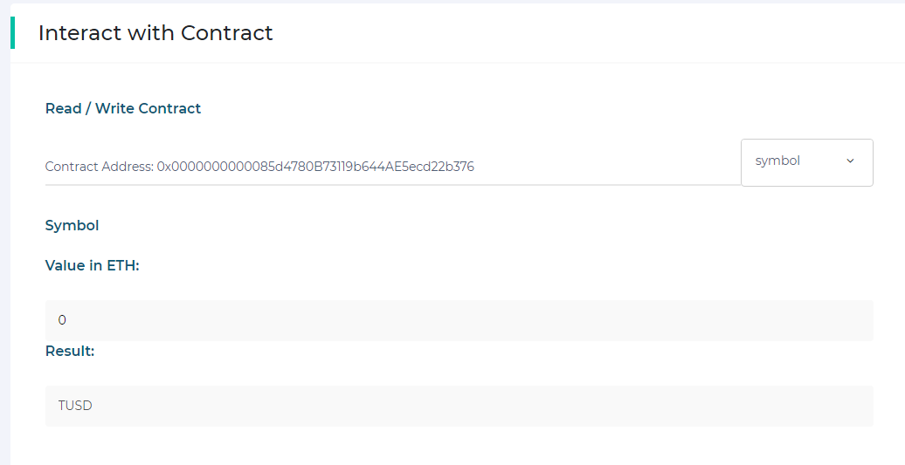
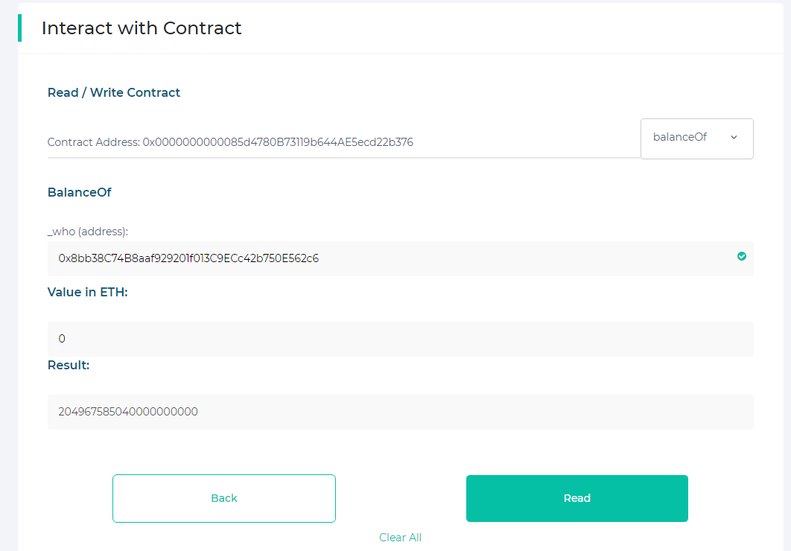
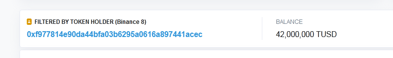
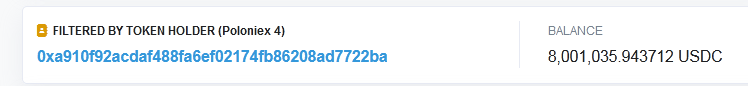

## Como Ejecutar Exitosamente en un Contrato, Funciones que DEBERÍAN estar allí pero no estan

Desde el advenimiento de las "Stable Coins" toda una revolución silenciosa se ha venido desatando en el mundo de las nuevas tecnologías financieras. 

Por fuertes razones de seguridad y resiliencia en la logística de operación, todo contrato que administra una stable coin, debe  incluir uuna estrategia de "actualizabilidad".

En el caso que nos ocupa, dedicaremos nuestra atención a tres monedas de relevancia emergente: [True-USD](https://etherscan.io/address/0x0000000000085d4780b73119b644ae5ecd22b376#code), [USD-Coin](https://etherscan.io/address/0xa0b86991c6218b36c1d19d4a2e9eb0ce3606eb48#code) y [EURO-Stasis](https://etherscan.io/address/0xdb25f211ab05b1c97d595516f45794528a807ad8#code) y vamos a desentrañar su mágico funcionamiento.

Al comparar las lineas de código de estos contratos con el [estándar](https://en.bitcoinwiki.org/wiki/ERC20) que se espera debe cumplir un token ERC20, nos damos con la sorpresa quizá desagradable de que poco o nada tiene que ver su código con lo esperado.

Por ejemplo, la función "totalSupply" que es un método obligatorio en un ERC20, no está por ninguna línea de código tanto en el contrato [True-USD](https://etherscan.io/address/0x0000000000085d4780b73119b644ae5ecd22b376#code), como en el código de [USD-Coin](https://etherscan.io/address/0xa0b86991c6218b36c1d19d4a2e9eb0ce3606eb48#code). Tampoco están otras funciones escenciales como la de "transferencia" o la de consulta de saldo de cada usuario. ¿Como pueden operar entonces estas monedas y porque las carteras tradicionales, como Metamask, no tienen ningún problema en ejecutar transacciones con ellas?

A continuación vamos a inspeccionar estos contratos a través del entorno [NODEjs](https://nodejs.org/es/) utilizando el paquete [web3.js](https://github.com/ethereum/web3.js/#installation). Es conveniente en principio, utilizando nuestra consola de comandos de preferencia (A mi me funciona mejor [GitBash](https://gitforwindows.org/) ), verificar si estas herramientas están instaladas:

```cmd
>npm -v
```
	
```cmd
>node -v
```

```cmd
> npm view web3 version
```

Si alguna de estas consultas falla, lo más probable es que la instalación es requerida.

A continuación podemos proceder del siguiente modo:

N° 1 Ingresaremos a la consola de node, como nuestro ambiente de ejecución para nuestro paquete web3:

```cmd
C:\Users\MiUsuario\CarpetaLocal\>node
>_

```

N° 2 Ahora solicitaremos la biblioteca 'web3' almacenandola en una variable ligeramente diferente: Web3 (con 'W' mayúscula).

```cmd
>var Web3 = require('web3')
undefined 
>_
```

N° 3 Lo siguiente es encontrar la URL de algun servicio proveedor de conexion remota a la red de ethereum. Una forma de hacerlo es mediente los servicios de la empresa [INFURA](https://infura.io/). Para un trafico bajo y entornos de prueba, se puede obtener un enlace totalmente gratuito tanto para la red principal como para la mayoría de las redes de prueba.

Hay que realizar una sencilla subscripción y registrar un proyecto. A cambio la plataforma nos da una direción URL que nos dará acceso indirecto a la red ethereum. Esta dirección tendrá la forma de:

```url
mainnet.infura.io/v3/PROJECT_KEY_NUMBER
```

N° 4 Ahora estamos en capacidad de obtener una instancia de web3:

```cmd
>var url = 'https://mainnet.infura.io/v3/PROJECT_KEY_NUMBER'
undefined 
>var web3 = new Web3(url)
undefined 
>_
```

N° 5 Creamos ahora una instancia del contrato que se desea inspeccionar. Pero hay un pequeño problema: para reconstruir dicha instancia necesitamos la dirección donde dicho contrato reside en la blocchain y ademas, el archivo ABI.json del contrato.

Pero si extraemos el achivo ABI.json del contrato directamente desplegado de, digamos, [True-USD](https://etherscan.io/address/0x0000000000085d4780b73119b644ae5ecd22b376#code), no vamos a ser capaces de ejecutar ninguna funcion digna de un token ERC20. ¿Como hacemos?

En el caso normal haríamos lo siguiente: usamos algun explorador apropiado como por ejemplo [Etherscan](https://etherscan.io/) y buscamos el contrato de nuestro interés. Si esto pareciera buscar una aguja en un pajar, es posible hacerlo mediante la opción de la pagina de los "Tokens", los más famosos. También podemos ubicar la pagina exploradora de un token en partricular, al encontrarlo en la página [CoinMArketCap](https://coinmarketcap.com/).

Lo notable de toda esta información es que es pública. De modo que el "contract ABI" podremos copiarlo directamente de la página donde el contrato esta expuesto en etherscan (siempre y cuando el dueño del código haya [verificado](https://github.com/jjmr007/Deploying-and-Verifying-a-Contract-using-Remix-and-Etherscan) el contrato).

Una vez copiada la data del ABI, vamos a la consola y la declaramos:

```cmd
>var abi = [{"constant":true,"inputs":[],"name":"proxyOwner","outputs":[{"name":"owner","type":"address"}],"payable":false,"stateMutability":"view","type":"function"},{"constant":true,"inputs":[],"name":"pendingProxyOwner","outputs":[{"name":"pendingOwner","type":"address"}],"payable":false,"stateMutability":"view","type":"function"},{"constant":false,"inputs":[{"name":"implementation","type":"address"}],"name":"upgradeTo","outputs":[],"payable":false,"stateMutability":"nonpayable","type":"function"},{"constant":true,"inputs":[],"name":"implementation","outputs":[{"name":"impl","type":"address"}],"payable":false,"stateMutability":"view","type":"function"},{"constant":false,"inputs":[],"name":"claimProxyOwnership","outputs":[],"payable":false,"stateMutability":"nonpayable","type":"function"},{"constant":false,"inputs":[{"name":"newOwner","type":"address"}],"name":"transferProxyOwnership","outputs":[],"payable":false,"stateMutability":"nonpayable","type":"function"},{"inputs":[],"payable":false,"stateMutability":"nonpayable","type":"constructor"},{"payable":true,"stateMutability":"payable","type":"fallback"},{"anonymous":false,"inputs":[{"indexed":true,"name":"previousOwner","type":"address"},{"indexed":true,"name":"newOwner","type":"address"}],"name":"ProxyOwnershipTransferred","type":"event"},{"anonymous":false,"inputs":[{"indexed":false,"name":"currentOwner","type":"address"},{"indexed":false,"name":"pendingOwner","type":"address"}],"name":"NewPendingOwner","type":"event"},{"anonymous":false,"inputs":[{"indexed":true,"name":"implementation","type":"address"}],"name":"Upgraded","type":"event"}]
undefined 
>_
```

En este caso el ABI es el de la version oficial del contrato [True-USD](https://etherscan.io/address/0x0000000000085d4780b73119b644ae5ecd22b376#code). Podemos inspeccionar el contenido de este elemento al ejecutar:

```cmd
>abi 
```

A continuación se despliega de manera ordenada todo el contenido y será mas o menos accesible a simple vista. Será bastante evidente que ninguna función de un token ERC20 existe.


Como era de esperar, nada de "transfer" o de "balanceOf". Y ahora ¿Que hacemos?

N° 6 Lo primero que nos llama la atención es que se trata de un contrato que ya sufrió una actualización. Su número de address extraña e inexplicablemente posee una secuencia de 11 ceros! ¿cómo lograron semejante excentricidad?

Utilizando una aplicación especial para calcular "[direcciones vanidosas](https://github.com/MyEtherWallet/VanityEth)" que lo que hacen es generar del mismo modo que un software de minería, múltiples llaves privadas para la dirección externamente controlada (EOA) que ha de ordenar el despliegue de un contrato, hasta que el contrato desplegado posea la cantidad de ceros que el algoritmo pueda costear o el usuario este dispuesto a esperar que sean generados. Esto lo llevó a cabo la empresa [Trust-Token](https://www.trusttoken.com/) con el fin de otorgar una cualidad de seguridad extra a su contrato.

Por otro lado, el contrato no lleva como nombre "True-USD", eso quedó en el pasado!. Ahora se llama: "OwnedUpgradeabilityProxy" y es la secuencia de varios bloques de codigos en forma de contratos abstractos, heredados uno tras otro hasta el contrato efectivamente compilable y cuya característica principal es la presencia de una función sin nombre alguno, conocida como [FALLBACK-FUNCTION](https://solidity.readthedocs.io/en/v0.4.23/contracts.html#fallback-function): una funcion obligatoriamente de acceso externo y que no posee argumentos!.

Según la documentación de solidity: 

>"todo contrato puede tener exactamente UNA sola funcion sin nombre. No puede tener argumentos y no puede retornar ningún valor. Esta función se ejecuta cuando el contrato que la contiene es llamado y ninguna de las funciones que posee en su ABI *COINCIDE* con la función que esta siendo invocada contra dicho contrato, o si ninguna data sobre función alguna es suministrada".

Continúa el repositorio:

>"Adicionalmente esta función se ejecuta cuando un contrato recibe dinero (en ethers, y sin ninguna otra data asociada a la transacción) pero solamente cuando ha sido etiquetada como **_payable_**. Si tales condiciones no se cumplen, el contrato rechaza cualquier envio de fondos en forma de ethereum." 

Pero lo curioso de esta función son las instrucciones que ordena dentro de su descripción interna:

```js
function() external payable {
        address _impl = implementation();
        require(_impl != address(0), "implementation contract not set");
        
        assembly {
            let ptr := mload(0x40)
            calldatacopy(ptr, 0, calldatasize)
            let result := delegatecall(gas, _impl, ptr, calldatasize, 0, 0)
            let size := returndatasize
            returndatacopy(ptr, 0, size)

            switch result
            case 0 { revert(ptr, size) }
            default { return(ptr, size) }
        }
    }
```

Existe una variable de tipo address llamada "*implementation*" (_impl) que solo es tomada en cuenta si es distinta de cero (es decir si ha sido definida) y que se supone, **se trata de otro contrato** y que ejecuta una serie de instrucciones a nivel de **_assembly_**, y que básicamente lo que hace es tomar la data que se le esta instruyendo ejecutar y la esta ejecutando mediante el [comando operaciopnal](https://ethervm.io/) **_DELEGATECALL_**.

Las instrucciones de *Assembly* mas o menos estan instruyendo lo siguiente:

 - i.- En una variable *ptr* se almacena la data de la función que se desea ejecutar y que se almacena en la memoria *a partir* de la posición 0x40, y la cantidad de datos depende del numero que se recupera de **_calldatasize_**.
 - ii.- En otra variable llamada *result* se **recoge** el resultado de llamar al contrato *implementation* y ejecutar las ordenes que están en ptr, pero, en lugar de hacerlo según el comando **_call_**, **delegatecall** ejecuta todo lo que tiene que hacer como si el contrato que hace las cosas fuera el que le esta invocando y todo cuanto escribe y todo estado que se cambia se asienta en el contrato invocador, y no en el invocado. Esto esta magistralmente explicado en la nota que [CENTRE](https://medium.com/centre-blog/designing-an-upgradeable-ethereum-contract-3d850f637794) preparó esoecialmente para esta innovadora estrategia, y que sin duda es un avance en el estado del arte de estas tecnologías financieras.
   
   - Lo importante a rescatar aqui es que cuando un contrato invoca la ejecución de una función de otro mediante el comando **delegatecall**, todos los cambios de estado, todo cuanto se escribe, todo fondo que se recibe, llega, se escribe y se actualiza **_en el contrato invocador_**, *no en el invocado*!
   
   
   
 - iii.- Esto significa que no es necesario que la función sin nombre devuelva ningun argumento, ya que la orden de assembly *returndatacopy* almacenará en memoria todo lo que haga falta recuperar! (por lo que es innecesario que la funcion sin nombre devuelva explícitamente argumento alguno, ya que estos quedan alojados en la memoria volatil de la máquina virtual de ethereum y pueden rescatarse mediante la interfaz que este utilizando el usuario).

Todo esto significa que si se ejecuta una función de reemplazo de *implementation*; sin que  nadie siquiera lo note, la lógica que empezará a ejecutar el contrato habrá sido actualizada, sin alterar la data ni los valores de saldo de ninguno de los usuarios!

N° 7 De modo que para ejecutar correctamente el contrato [True-USD](https://etherscan.io/address/0x0000000000085d4780b73119b644ae5ecd22b376#code), lo único que necesitamos es rescatar el ABI de la función de implementación, a no ser que deseemos ejecutar alguna función de control nativa del contrato en cuestion, tal como modificar al contrato de implementación o cambiar al administrtador del contrato. El valor de la address del contrato de implementación en el caso de Trust-USD es pública y es [fácilmente rescatable](https://etherscan.io/address/0x0000000000085d4780b73119b644ae5ecd22b376#readContract) como "*implementation*", y su valor es `0xcb9a11afdc6bdb92e4a6235959455f28758b34ba`. Por ende el [ABI](https://etherscan.io/address/0xcb9a11afdc6bdb92e4a6235959455f28758b34ba#code) del contrato de la implementacion es fácilmente rescatable (esta vez se trata de una data mucho más extensa):

```cmd
>var abi = [{"constant":true,"inputs":[],"name":"burnMin","outputs":[{"name":"","type":"uint256"}],"payable":false,"stateMutability":"view","type":"function"},{"constant":true,"inputs":[],"name":"name","outputs":[{"name":"","type":"string"}],"payable":false,"stateMutability":"pure","type":"function"},{"constant":false,"inputs":[{"name":"_spender","type":"address"},{"name":"_value","type":"uint256"}],"name":"approve","outputs":[{"name":"","type":"bool"}],"payable":false,"stateMutability":"nonpayable","type":"function"},{"constant":true,"inputs":[{"name":"owner","type":"address"},{"name":"spender","type":"address"}],"name":"delegateAllowance","outputs":[{"name":"","type":"uint256"}],"payable":false,"stateMutability":"view","type":"function"},{"constant":true,"inputs":[],"name":"totalSupply","outputs":[{"name":"","type":"uint256"}],"payable":false,"stateMutability":"view","type":"function"},{"constant":false,"inputs":[{"name":"_minimumGasPriceForFutureRefunds","type":"uint256"}],"name":"setMinimumGasPriceForFutureRefunds","outputs":[],"payable":false,"stateMutability":"nonpayable","type":"function"},{"constant":false,"inputs":[{"name":"_from","type":"address"},{"name":"_to","type":"address"},{"name":"_value","type":"uint256"}],"name":"transferFrom","outputs":[{"name":"","type":"bool"}],"payable":false,"stateMutability":"nonpayable","type":"function"},{"constant":false,"inputs":[],"name":"sponsorGas","outputs":[],"payable":false,"stateMutability":"nonpayable","type":"function"},{"constant":false,"inputs":[{"name":"spender","type":"address"},{"name":"value","type":"uint256"},{"name":"origSender","type":"address"}],"name":"delegateApprove","outputs":[{"name":"","type":"bool"}],"payable":false,"stateMutability":"nonpayable","type":"function"},{"constant":false,"inputs":[{"name":"_ownable","type":"address"}],"name":"reclaimContract","outputs":[],"payable":false,"stateMutability":"nonpayable","type":"function"},{"constant":true,"inputs":[],"name":"rounding","outputs":[{"name":"","type":"uint8"}],"payable":false,"stateMutability":"pure","type":"function"},{"constant":true,"inputs":[],"name":"decimals","outputs":[{"name":"","type":"uint8"}],"payable":false,"stateMutability":"pure","type":"function"},{"constant":true,"inputs":[],"name":"minimumGasPriceForFutureRefunds","outputs":[{"name":"","type":"uint256"}],"payable":false,"stateMutability":"view","type":"function"},{"constant":false,"inputs":[{"name":"_to","type":"address"},{"name":"_value","type":"uint256"}],"name":"mint","outputs":[],"payable":false,"stateMutability":"nonpayable","type":"function"},{"constant":false,"inputs":[{"name":"_value","type":"uint256"}],"name":"burn","outputs":[],"payable":false,"stateMutability":"nonpayable","type":"function"},{"constant":true,"inputs":[{"name":"who","type":"address"}],"name":"delegateBalanceOf","outputs":[{"name":"","type":"uint256"}],"payable":false,"stateMutability":"view","type":"function"},{"constant":false,"inputs":[{"name":"from","type":"address"},{"name":"to","type":"address"},{"name":"value","type":"uint256"},{"name":"origSender","type":"address"}],"name":"delegateTransferFrom","outputs":[{"name":"","type":"bool"}],"payable":false,"stateMutability":"nonpayable","type":"function"},{"constant":false,"inputs":[],"name":"claimOwnership","outputs":[],"payable":false,"stateMutability":"nonpayable","type":"function"},{"constant":false,"inputs":[{"name":"_min","type":"uint256"},{"name":"_max","type":"uint256"}],"name":"setBurnBounds","outputs":[],"payable":false,"stateMutability":"nonpayable","type":"function"},{"constant":false,"inputs":[{"name":"spender","type":"address"},{"name":"addedValue","type":"uint256"},{"name":"origSender","type":"address"}],"name":"delegateIncreaseApproval","outputs":[{"name":"","type":"bool"}],"payable":false,"stateMutability":"nonpayable","type":"function"},{"constant":true,"inputs":[],"name":"minimumGasPriceForRefund","outputs":[{"name":"result","type":"uint256"}],"payable":false,"stateMutability":"view","type":"function"},{"constant":true,"inputs":[],"name":"burnMax","outputs":[{"name":"","type":"uint256"}],"payable":false,"stateMutability":"view","type":"function"},{"constant":true,"inputs":[],"name":"paused","outputs":[{"name":"","type":"bool"}],"payable":false,"stateMutability":"pure","type":"function"},{"constant":false,"inputs":[{"name":"_spender","type":"address"},{"name":"_subtractedValue","type":"uint256"}],"name":"decreaseApproval","outputs":[{"name":"","type":"bool"}],"payable":false,"stateMutability":"nonpayable","type":"function"},{"constant":true,"inputs":[{"name":"_who","type":"address"}],"name":"balanceOf","outputs":[{"name":"","type":"uint256"}],"payable":false,"stateMutability":"view","type":"function"},{"constant":true,"inputs":[],"name":"delegateTotalSupply","outputs":[{"name":"","type":"uint256"}],"payable":false,"stateMutability":"view","type":"function"},{"constant":true,"inputs":[],"name":"registry","outputs":[{"name":"","type":"address"}],"payable":false,"stateMutability":"view","type":"function"},{"constant":true,"inputs":[],"name":"remainingGasRefundPool","outputs":[{"name":"length","type":"uint256"}],"payable":false,"stateMutability":"view","type":"function"},{"constant":false,"inputs":[{"name":"token","type":"address"},{"name":"_to","type":"address"}],"name":"reclaimToken","outputs":[],"payable":false,"stateMutability":"nonpayable","type":"function"},{"constant":true,"inputs":[],"name":"owner","outputs":[{"name":"","type":"address"}],"payable":false,"stateMutability":"view","type":"function"},{"constant":false,"inputs":[{"name":"spender","type":"address"},{"name":"subtractedValue","type":"uint256"},{"name":"origSender","type":"address"}],"name":"delegateDecreaseApproval","outputs":[{"name":"","type":"bool"}],"payable":false,"stateMutability":"nonpayable","type":"function"},{"constant":true,"inputs":[],"name":"symbol","outputs":[{"name":"","type":"string"}],"payable":false,"stateMutability":"pure","type":"function"},{"constant":false,"inputs":[{"name":"_to","type":"address"}],"name":"reclaimEther","outputs":[],"payable":false,"stateMutability":"nonpayable","type":"function"},{"constant":false,"inputs":[{"name":"to","type":"address"},{"name":"value","type":"uint256"},{"name":"origSender","type":"address"}],"name":"delegateTransfer","outputs":[{"name":"","type":"bool"}],"payable":false,"stateMutability":"nonpayable","type":"function"},{"constant":false,"inputs":[{"name":"_to","type":"address"},{"name":"_value","type":"uint256"}],"name":"transfer","outputs":[{"name":"","type":"bool"}],"payable":false,"stateMutability":"nonpayable","type":"function"},{"constant":false,"inputs":[{"name":"_registry","type":"address"}],"name":"setRegistry","outputs":[],"payable":false,"stateMutability":"nonpayable","type":"function"},{"constant":false,"inputs":[{"name":"_account","type":"address"}],"name":"wipeBlacklistedAccount","outputs":[],"payable":false,"stateMutability":"nonpayable","type":"function"},{"constant":false,"inputs":[],"name":"sponsorGas2","outputs":[],"payable":false,"stateMutability":"nonpayable","type":"function"},{"constant":false,"inputs":[{"name":"_spender","type":"address"},{"name":"_addedValue","type":"uint256"}],"name":"increaseApproval","outputs":[{"name":"","type":"bool"}],"payable":false,"stateMutability":"nonpayable","type":"function"},{"constant":true,"inputs":[{"name":"_who","type":"address"},{"name":"_spender","type":"address"}],"name":"allowance","outputs":[{"name":"","type":"uint256"}],"payable":false,"stateMutability":"view","type":"function"},{"constant":true,"inputs":[],"name":"pendingOwner","outputs":[{"name":"","type":"address"}],"payable":false,"stateMutability":"view","type":"function"},{"constant":true,"inputs":[{"name":"_index","type":"uint256"}],"name":"gasRefundPool","outputs":[{"name":"gasPrice","type":"uint256"}],"payable":false,"stateMutability":"view","type":"function"},{"constant":false,"inputs":[{"name":"newOwner","type":"address"}],"name":"transferOwnership","outputs":[],"payable":false,"stateMutability":"nonpayable","type":"function"},{"constant":false,"inputs":[{"name":"_who","type":"address"},{"name":"_attribute","type":"bytes32"},{"name":"_value","type":"uint256"}],"name":"syncAttributeValue","outputs":[],"payable":false,"stateMutability":"nonpayable","type":"function"},{"anonymous":false,"inputs":[{"indexed":true,"name":"account","type":"address"},{"indexed":false,"name":"balance","type":"uint256"}],"name":"WipeBlacklistedAccount","type":"event"},{"anonymous":false,"inputs":[{"indexed":true,"name":"registry","type":"address"}],"name":"SetRegistry","type":"event"},{"anonymous":false,"inputs":[{"indexed":false,"name":"newMin","type":"uint256"},{"indexed":false,"name":"newMax","type":"uint256"}],"name":"SetBurnBounds","type":"event"},{"anonymous":false,"inputs":[{"indexed":true,"name":"burner","type":"address"},{"indexed":false,"name":"value","type":"uint256"}],"name":"Burn","type":"event"},{"anonymous":false,"inputs":[{"indexed":true,"name":"to","type":"address"},{"indexed":false,"name":"value","type":"uint256"}],"name":"Mint","type":"event"},{"anonymous":false,"inputs":[{"indexed":true,"name":"owner","type":"address"},{"indexed":true,"name":"spender","type":"address"},{"indexed":false,"name":"value","type":"uint256"}],"name":"Approval","type":"event"},{"anonymous":false,"inputs":[{"indexed":true,"name":"from","type":"address"},{"indexed":true,"name":"to","type":"address"},{"indexed":false,"name":"value","type":"uint256"}],"name":"Transfer","type":"event"},{"anonymous":false,"inputs":[{"indexed":true,"name":"previousOwner","type":"address"},{"indexed":true,"name":"newOwner","type":"address"}],"name":"OwnershipTransferred","type":"event"}]
undefined 
>_
```

Y ahora al inspeccionar al ABI se obtiene

```cmd
>abi 
```

	

En donde se observan las funciones mas *comunes* de un token ERC20.

Ahora, si es posible crear la instancia adecuada del contrato:

```cmd
>var interfaz = '0xcb9a11afdc6bdb92e4a6235959455f28758b34ba'
undefined 
>var token = '0x0000000000085d4780B73119b644AE5ecd22b376'
undefined 
>var contrato = new web3.eth.Contract(abi, token)
undefined 
>_
```

Y se pueden obtener los *métodos* ejecutables dese el token mediante la interfaz:

```cmd
>contrato.methods
```

Existe otro modo de hacer esto mismo utilizando [MyEtherWallet](https://www.myetherwallet.com/access-my-wallet) donde al iniciar la cartera con Metamask, vamos a la sección contratos, colocamos la addres del token y en la sección del ABI, colocamos el .json de la implementación (cuidando de haber elegido la red correcta, en este caso MAIN):








Desde la consola pueden intentarse metodos similares:

```cmd
>contrato.methods.name().call(function(err, result) { console.log(result) })
Promise { <pending> }
> TrueUSD
```

```cmd
>contrato.methods.totalSupply().call(function(err, result) { console.log(result) })
Promise { <pending> }
> 144003798740000000000000000
``` 

La razón de pasar los resultados de call() a una función e imprimir estos resultados en consola, es debido a la asincronicidad que se experimenta en la interfaz entre java-script y web3.eth.

```cmd
>contrato.methods.decimals().call(function(err, result) { console.log(result) })
Promise { <pending> }
> 18
``` 

```cmd
>contrato.methods.symbol().call(function(err, result) { console.log(result) })
Promise { <pending> }
> TUSD
``` 

Como ejercicio, observemos que si hubiesemos utilizado como contrato a la interfaz, aún cuando esta tiene legítimamente el código ABI que hemos ejecutado, encontraremos que sobre este contrato apenas si se ha escrito algo. Es decir, tiene un totalSupply de cero, nadie tiene saldos, etc.

```cmd
>var contrato = new web3.eth.Contract(abi, interfaz)
undefined
>contrato.methods.totalSupply().call(function(err, result) { console.log(result) })
Promise { <pending> }
> 0
``` 

```cmd
>contrato.methods.balanceOf('0x8bb38C74B8aaf929201f013C9ECc42b750E562c6').call(function(err, result) { console.log(result) })
Promise { <pending> }
> 0
``` 

N° 8 Antes de cerrar el caso interesante de Trust-Coin, debe decirse que estos emprendedores fueron pioneros en la estrategia de la actualización de la plataforma. Su primer plan era primitivo, y era el de copiar los datos a un nuevo contrato, conforme se fueran movilizando los tokens. De este modo quedo para la posteridad un contrato "[Legacy](https://etherscan.io/address/0x8dd5fbCe2F6a956C3022bA3663759011Dd51e73E#code)", contra el cual aun hoy y de manera indefinida se podrán seguir realizando transacciones del token de manera totalmente normal.

Si repetimos los anteriores ejercicios con legacy encontraremos que este contrato conserva su data como un espejo perfecto de la data del contrato activo oficial:

```cmd
>var legacy = '0x8dd5fbCe2F6a956C3022bA3663759011Dd51e73E'
undefined
>_
``` 

Desde luego hay que sustituir el ABI por el que corresponde originalmente a este contrato:

```cmd
>var abi = [{"constant":true,"inputs":[],"name":"burnMin","outputs":[{"name":"","type":"uint256"}],"payable":false,"stateMutability":"view","type":"function"},{"constant":true,"inputs":[],"name":"name","outputs":[{"name":"","type":"string"}],"payable":false,"stateMutability":"view","type":"function"},{"constant":false,"inputs":[{"name":"spender","type":"address"},{"name":"value","type":"uint256"}],"name":"approve","outputs":[{"name":"","type":"bool"}],"payable":false,"stateMutability":"nonpayable","type":"function"},{"constant":true,"inputs":[{"name":"owner","type":"address"},{"name":"spender","type":"address"}],"name":"delegateAllowance","outputs":[{"name":"","type":"uint256"}],"payable":false,"stateMutability":"view","type":"function"},{"constant":true,"inputs":[],"name":"burnFeeFlat","outputs":[{"name":"","type":"uint256"}],"payable":false,"stateMutability":"view","type":"function"},{"constant":false,"inputs":[{"name":"_canReceiveMintWhiteList","type":"address"},{"name":"_canBurnWhiteList","type":"address"},{"name":"_blackList","type":"address"},{"name":"_noFeesList","type":"address"}],"name":"setLists","outputs":[],"payable":false,"stateMutability":"nonpayable","type":"function"},{"constant":false,"inputs":[{"name":"token","type":"address"}],"name":"reclaimToken","outputs":[],"payable":false,"stateMutability":"nonpayable","type":"function"},{"constant":true,"inputs":[],"name":"totalSupply","outputs":[{"name":"","type":"uint256"}],"payable":false,"stateMutability":"view","type":"function"},{"constant":false,"inputs":[{"name":"newContract","type":"address"}],"name":"delegateToNewContract","outputs":[],"payable":false,"stateMutability":"nonpayable","type":"function"},{"constant":false,"inputs":[{"name":"_transferFeeNumerator","type":"uint80"},{"name":"_transferFeeDenominator","type":"uint80"},{"name":"_mintFeeNumerator","type":"uint80"},{"name":"_mintFeeDenominator","type":"uint80"},{"name":"_mintFeeFlat","type":"uint256"},{"name":"_burnFeeNumerator","type":"uint80"},{"name":"_burnFeeDenominator","type":"uint80"},{"name":"_burnFeeFlat","type":"uint256"}],"name":"changeStakingFees","outputs":[],"payable":false,"stateMutability":"nonpayable","type":"function"},{"constant":true,"inputs":[],"name":"canReceiveMintWhiteList","outputs":[{"name":"","type":"address"}],"payable":false,"stateMutability":"view","type":"function"},{"constant":false,"inputs":[{"name":"from","type":"address"},{"name":"to","type":"address"},{"name":"value","type":"uint256"}],"name":"transferFrom","outputs":[{"name":"","type":"bool"}],"payable":false,"stateMutability":"nonpayable","type":"function"},{"constant":true,"inputs":[],"name":"delegatedFrom","outputs":[{"name":"","type":"address"}],"payable":false,"stateMutability":"view","type":"function"},{"constant":false,"inputs":[{"name":"spender","type":"address"},{"name":"value","type":"uint256"},{"name":"origSender","type":"address"}],"name":"delegateApprove","outputs":[{"name":"","type":"bool"}],"payable":false,"stateMutability":"nonpayable","type":"function"},{"constant":false,"inputs":[{"name":"contractAddr","type":"address"}],"name":"reclaimContract","outputs":[],"payable":false,"stateMutability":"nonpayable","type":"function"},{"constant":true,"inputs":[],"name":"decimals","outputs":[{"name":"","type":"uint8"}],"payable":false,"stateMutability":"view","type":"function"},{"constant":true,"inputs":[],"name":"allowances","outputs":[{"name":"","type":"address"}],"payable":false,"stateMutability":"view","type":"function"},{"constant":false,"inputs":[],"name":"unpause","outputs":[],"payable":false,"stateMutability":"nonpayable","type":"function"},{"constant":false,"inputs":[{"name":"_to","type":"address"},{"name":"_amount","type":"uint256"}],"name":"mint","outputs":[],"payable":false,"stateMutability":"nonpayable","type":"function"},{"constant":false,"inputs":[{"name":"_value","type":"uint256"}],"name":"burn","outputs":[],"payable":false,"stateMutability":"nonpayable","type":"function"},{"constant":true,"inputs":[{"name":"who","type":"address"}],"name":"delegateBalanceOf","outputs":[{"name":"","type":"uint256"}],"payable":false,"stateMutability":"view","type":"function"},{"constant":false,"inputs":[{"name":"from","type":"address"},{"name":"to","type":"address"},{"name":"value","type":"uint256"},{"name":"origSender","type":"address"}],"name":"delegateTransferFrom","outputs":[{"name":"","type":"bool"}],"payable":false,"stateMutability":"nonpayable","type":"function"},{"constant":false,"inputs":[],"name":"claimOwnership","outputs":[],"payable":false,"stateMutability":"nonpayable","type":"function"},{"constant":false,"inputs":[{"name":"sheet","type":"address"}],"name":"setBalanceSheet","outputs":[],"payable":false,"stateMutability":"nonpayable","type":"function"},{"constant":false,"inputs":[{"name":"spender","type":"address"},{"name":"addedValue","type":"uint256"},{"name":"origSender","type":"address"}],"name":"delegateIncreaseApproval","outputs":[{"name":"","type":"bool"}],"payable":false,"stateMutability":"nonpayable","type":"function"},{"constant":true,"inputs":[],"name":"burnFeeNumerator","outputs":[{"name":"","type":"uint80"}],"payable":false,"stateMutability":"view","type":"function"},{"constant":true,"inputs":[],"name":"canBurnWhiteList","outputs":[{"name":"","type":"address"}],"payable":false,"stateMutability":"view","type":"function"},{"constant":true,"inputs":[],"name":"burnMax","outputs":[{"name":"","type":"uint256"}],"payable":false,"stateMutability":"view","type":"function"},{"constant":true,"inputs":[],"name":"paused","outputs":[{"name":"","type":"bool"}],"payable":false,"stateMutability":"view","type":"function"},{"constant":true,"inputs":[],"name":"mintFeeDenominator","outputs":[{"name":"","type":"uint80"}],"payable":false,"stateMutability":"view","type":"function"},{"constant":true,"inputs":[],"name":"staker","outputs":[{"name":"","type":"address"}],"payable":false,"stateMutability":"view","type":"function"},{"constant":false,"inputs":[{"name":"addr","type":"address"}],"name":"setDelegatedFrom","outputs":[],"payable":false,"stateMutability":"nonpayable","type":"function"},{"constant":false,"inputs":[{"name":"spender","type":"address"},{"name":"subtractedValue","type":"uint256"}],"name":"decreaseApproval","outputs":[{"name":"","type":"bool"}],"payable":false,"stateMutability":"nonpayable","type":"function"},{"constant":true,"inputs":[],"name":"noFeesList","outputs":[{"name":"","type":"address"}],"payable":false,"stateMutability":"view","type":"function"},{"constant":true,"inputs":[{"name":"who","type":"address"}],"name":"balanceOf","outputs":[{"name":"","type":"uint256"}],"payable":false,"stateMutability":"view","type":"function"},{"constant":false,"inputs":[{"name":"newMin","type":"uint256"},{"name":"newMax","type":"uint256"}],"name":"changeBurnBounds","outputs":[],"payable":false,"stateMutability":"nonpayable","type":"function"},{"constant":true,"inputs":[],"name":"delegateTotalSupply","outputs":[{"name":"","type":"uint256"}],"payable":false,"stateMutability":"view","type":"function"},{"constant":true,"inputs":[],"name":"balances","outputs":[{"name":"","type":"address"}],"payable":false,"stateMutability":"view","type":"function"},{"constant":false,"inputs":[],"name":"pause","outputs":[],"payable":false,"stateMutability":"nonpayable","type":"function"},{"constant":false,"inputs":[{"name":"_name","type":"string"},{"name":"_symbol","type":"string"}],"name":"changeName","outputs":[],"payable":false,"stateMutability":"nonpayable","type":"function"},{"constant":true,"inputs":[],"name":"mintFeeNumerator","outputs":[{"name":"","type":"uint80"}],"payable":false,"stateMutability":"view","type":"function"},{"constant":true,"inputs":[],"name":"owner","outputs":[{"name":"","type":"address"}],"payable":false,"stateMutability":"view","type":"function"},{"constant":true,"inputs":[],"name":"transferFeeNumerator","outputs":[{"name":"","type":"uint80"}],"payable":false,"stateMutability":"view","type":"function"},{"constant":false,"inputs":[{"name":"spender","type":"address"},{"name":"subtractedValue","type":"uint256"},{"name":"origSender","type":"address"}],"name":"delegateDecreaseApproval","outputs":[{"name":"","type":"bool"}],"payable":false,"stateMutability":"nonpayable","type":"function"},{"constant":true,"inputs":[],"name":"symbol","outputs":[{"name":"","type":"string"}],"payable":false,"stateMutability":"view","type":"function"},{"constant":false,"inputs":[{"name":"to","type":"address"},{"name":"value","type":"uint256"},{"name":"origSender","type":"address"}],"name":"delegateTransfer","outputs":[{"name":"","type":"bool"}],"payable":false,"stateMutability":"nonpayable","type":"function"},{"constant":false,"inputs":[],"name":"reclaimEther","outputs":[],"payable":false,"stateMutability":"nonpayable","type":"function"},{"constant":false,"inputs":[{"name":"to","type":"address"},{"name":"value","type":"uint256"}],"name":"transfer","outputs":[{"name":"","type":"bool"}],"payable":false,"stateMutability":"nonpayable","type":"function"},{"constant":false,"inputs":[{"name":"newStaker","type":"address"}],"name":"changeStaker","outputs":[],"payable":false,"stateMutability":"nonpayable","type":"function"},{"constant":false,"inputs":[{"name":"account","type":"address"}],"name":"wipeBlacklistedAccount","outputs":[],"payable":false,"stateMutability":"nonpayable","type":"function"},{"constant":false,"inputs":[{"name":"from_","type":"address"},{"name":"value_","type":"uint256"},{"name":"data_","type":"bytes"}],"name":"tokenFallback","outputs":[],"payable":false,"stateMutability":"nonpayable","type":"function"},{"constant":true,"inputs":[],"name":"burnFeeDenominator","outputs":[{"name":"","type":"uint80"}],"payable":false,"stateMutability":"view","type":"function"},{"constant":true,"inputs":[],"name":"delegate","outputs":[{"name":"","type":"address"}],"payable":false,"stateMutability":"view","type":"function"},{"constant":true,"inputs":[],"name":"blackList","outputs":[{"name":"","type":"address"}],"payable":false,"stateMutability":"view","type":"function"},{"constant":true,"inputs":[],"name":"transferFeeDenominator","outputs":[{"name":"","type":"uint80"}],"payable":false,"stateMutability":"view","type":"function"},{"constant":true,"inputs":[],"name":"mintFeeFlat","outputs":[{"name":"","type":"uint256"}],"payable":false,"stateMutability":"view","type":"function"},{"constant":false,"inputs":[{"name":"spender","type":"address"},{"name":"addedValue","type":"uint256"}],"name":"increaseApproval","outputs":[{"name":"","type":"bool"}],"payable":false,"stateMutability":"nonpayable","type":"function"},{"constant":true,"inputs":[{"name":"_owner","type":"address"},{"name":"spender","type":"address"}],"name":"allowance","outputs":[{"name":"","type":"uint256"}],"payable":false,"stateMutability":"view","type":"function"},{"constant":true,"inputs":[],"name":"pendingOwner","outputs":[{"name":"","type":"address"}],"payable":false,"stateMutability":"view","type":"function"},{"constant":false,"inputs":[{"name":"sheet","type":"address"}],"name":"setAllowanceSheet","outputs":[],"payable":false,"stateMutability":"nonpayable","type":"function"},{"constant":false,"inputs":[{"name":"newOwner","type":"address"}],"name":"transferOwnership","outputs":[],"payable":false,"stateMutability":"nonpayable","type":"function"},{"inputs":[],"payable":false,"stateMutability":"nonpayable","type":"constructor"},{"payable":false,"stateMutability":"nonpayable","type":"fallback"},{"anonymous":false,"inputs":[{"indexed":false,"name":"newMin","type":"uint256"},{"indexed":false,"name":"newMax","type":"uint256"}],"name":"ChangeBurnBoundsEvent","type":"event"},{"anonymous":false,"inputs":[{"indexed":true,"name":"to","type":"address"},{"indexed":false,"name":"amount","type":"uint256"}],"name":"Mint","type":"event"},{"anonymous":false,"inputs":[{"indexed":true,"name":"account","type":"address"},{"indexed":false,"name":"balance","type":"uint256"}],"name":"WipedAccount","type":"event"},{"anonymous":false,"inputs":[{"indexed":true,"name":"newContract","type":"address"}],"name":"DelegatedTo","type":"event"},{"anonymous":false,"inputs":[{"indexed":true,"name":"burner","type":"address"},{"indexed":false,"name":"value","type":"uint256"}],"name":"Burn","type":"event"},{"anonymous":false,"inputs":[],"name":"Pause","type":"event"},{"anonymous":false,"inputs":[],"name":"Unpause","type":"event"},{"anonymous":false,"inputs":[{"indexed":true,"name":"previousOwner","type":"address"},{"indexed":true,"name":"newOwner","type":"address"}],"name":"OwnershipTransferred","type":"event"},{"anonymous":false,"inputs":[{"indexed":true,"name":"owner","type":"address"},{"indexed":true,"name":"spender","type":"address"},{"indexed":false,"name":"value","type":"uint256"}],"name":"Approval","type":"event"},{"anonymous":false,"inputs":[{"indexed":true,"name":"from","type":"address"},{"indexed":true,"name":"to","type":"address"},{"indexed":false,"name":"value","type":"uint256"}],"name":"Transfer","type":"event"}]
undefined
>_
``` 

```cmd
>var contrato = new web3.eth.Contract(abi, interfaz)
undefined
>contrato.methods.totalSupply().call(function(err, result) { console.log(result) })
Promise { <pending> }
> 144003798740000000000000000
```

De acuerdo a Etherscan, la exchange Binance posee para el momento que se realiza esta consulta:



De acuerdo a legacy:

```cmd
>contrato.methods.balanceOf('0xF977814e90dA44bFA03b6295A0616a897441aceC').call(function(err, result) { console.log(result) })
Promise { <pending> }
> 42000000000000000000000000
``` 


N° 9 Pasemos al caso mucho más evolucionado de [USD-Coin](https://etherscan.io/address/0xa0b86991c6218b36c1d19d4a2e9eb0ce3606eb48#code). Este equipo de desarrolladores ya habia aprendido las duras lecciones de sus predecesores y construyó un contrato mucho mas simple, compacto y versatil.

```cmd
>var token = '0xA0b86991c6218b36c1d19D4a2e9Eb0cE3606eB48'
undefined 
>_
```

Pero para descubrir ahora el ABI, necesitamos la interfaz, que este equipo tuvo la astucia de mantener "*internal*", una variable privada. Aunque ciertamente, nada en la blockchain de ethereum esta oculto, hay modos de complicarle la vida a los advenedizos y curiosos.

En este caso, el contrato que invoca al token USD-Coin se denomina "FiatTokenProxy", y su "*Fallback-Function*", hace una llamada indirecta a una funcion interna (privada) que es la que contiene el codigo assembly, un poco mejor diseñado en cuanto a eficiencia (gracias también a los desarrolladores de [OpenZeppelin](https://github.com/OpenZeppelin/openzeppelin-labs/blob/master/initializer_contracts_with_args/contracts/Proxy.sol) ) y que contiene lo siguinete:

```js
  function () payable external {
    _fallback();
  }
  
  function _fallback() internal {
    _willFallback();
    _delegate(_implementation());
  }
  
  function _willFallback() internal {
  }
  
  function _implementation() internal view returns (address impl) {
    bytes32 slot = IMPLEMENTATION_SLOT;
    assembly {
      impl := sload(slot)
    }
  }

  function _delegate(address implementation) internal {
    assembly {
      // Copy msg.data. We take full control of memory in this inline assembly
      // block because it will not return to Solidity code. We overwrite the
      // Solidity scratch pad at memory position 0.
      calldatacopy(0, 0, calldatasize)

      // Call the implementation.
      // out and outsize are 0 because we don't know the size yet.
      let result := delegatecall(gas, implementation, 0, calldatasize, 0, 0)

      // Copy the returned data.
      returndatacopy(0, 0, returndatasize)

      switch result
      case 0 { revert(0, returndatasize) }
      default { return(0, returndatasize) }
    }
  }
```

Que escencialmente hace lo mismo que en el caso de Trust-Token. Afortunadamente el valor de la address del contrato de implementación fue invocado en la función constructora del contrato y hay que admitirlo, pudieron complicarle mucho mas las cosas a los curiosos novatos. Esta address de la implementación es:

```cmd
>var implementacion = '0x0882477e7895bdc5cea7cb1552ed914ab157fe56'
undefined 
>_
```

No solo eso: el equipo de Centre tuvo la gentileza de verificar el contrato de implementación, y su ABI es:

```cmd
>var abi = [{"constant":true,"inputs":[],"name":"name","outputs":[{"name":"","type":"string"}],"payable":false,"stateMutability":"view","type":"function"},{"constant":false,"inputs":[{"name":"_spender","type":"address"},{"name":"_value","type":"uint256"}],"name":"approve","outputs":[{"name":"","type":"bool"}],"payable":false,"stateMutability":"nonpayable","type":"function"},{"constant":true,"inputs":[],"name":"totalSupply","outputs":[{"name":"","type":"uint256"}],"payable":false,"stateMutability":"view","type":"function"},{"constant":false,"inputs":[{"name":"_account","type":"address"}],"name":"unBlacklist","outputs":[],"payable":false,"stateMutability":"nonpayable","type":"function"},{"constant":false,"inputs":[{"name":"_from","type":"address"},{"name":"_to","type":"address"},{"name":"_value","type":"uint256"}],"name":"transferFrom","outputs":[{"name":"","type":"bool"}],"payable":false,"stateMutability":"nonpayable","type":"function"},{"constant":false,"inputs":[{"name":"minter","type":"address"}],"name":"removeMinter","outputs":[{"name":"","type":"bool"}],"payable":false,"stateMutability":"nonpayable","type":"function"},{"constant":true,"inputs":[],"name":"decimals","outputs":[{"name":"","type":"uint8"}],"payable":false,"stateMutability":"view","type":"function"},{"constant":false,"inputs":[{"name":"_name","type":"string"},{"name":"_symbol","type":"string"},{"name":"_currency","type":"string"},{"name":"_decimals","type":"uint8"},{"name":"_masterMinter","type":"address"},{"name":"_pauser","type":"address"},{"name":"_blacklister","type":"address"},{"name":"_owner","type":"address"}],"name":"initialize","outputs":[],"payable":false,"stateMutability":"nonpayable","type":"function"},{"constant":true,"inputs":[],"name":"masterMinter","outputs":[{"name":"","type":"address"}],"payable":false,"stateMutability":"view","type":"function"},{"constant":false,"inputs":[],"name":"unpause","outputs":[],"payable":false,"stateMutability":"nonpayable","type":"function"},{"constant":false,"inputs":[{"name":"_to","type":"address"},{"name":"_amount","type":"uint256"}],"name":"mint","outputs":[{"name":"","type":"bool"}],"payable":false,"stateMutability":"nonpayable","type":"function"},{"constant":false,"inputs":[{"name":"_amount","type":"uint256"}],"name":"burn","outputs":[],"payable":false,"stateMutability":"nonpayable","type":"function"},{"constant":false,"inputs":[{"name":"minter","type":"address"},{"name":"minterAllowedAmount","type":"uint256"}],"name":"configureMinter","outputs":[{"name":"","type":"bool"}],"payable":false,"stateMutability":"nonpayable","type":"function"},{"constant":false,"inputs":[{"name":"_newPauser","type":"address"}],"name":"updatePauser","outputs":[],"payable":false,"stateMutability":"nonpayable","type":"function"},{"constant":true,"inputs":[],"name":"paused","outputs":[{"name":"","type":"bool"}],"payable":false,"stateMutability":"view","type":"function"},{"constant":true,"inputs":[{"name":"account","type":"address"}],"name":"balanceOf","outputs":[{"name":"","type":"uint256"}],"payable":false,"stateMutability":"view","type":"function"},{"constant":false,"inputs":[],"name":"pause","outputs":[],"payable":false,"stateMutability":"nonpayable","type":"function"},{"constant":true,"inputs":[{"name":"minter","type":"address"}],"name":"minterAllowance","outputs":[{"name":"","type":"uint256"}],"payable":false,"stateMutability":"view","type":"function"},{"constant":true,"inputs":[],"name":"owner","outputs":[{"name":"","type":"address"}],"payable":false,"stateMutability":"view","type":"function"},{"constant":true,"inputs":[],"name":"symbol","outputs":[{"name":"","type":"string"}],"payable":false,"stateMutability":"view","type":"function"},{"constant":true,"inputs":[],"name":"pauser","outputs":[{"name":"","type":"address"}],"payable":false,"stateMutability":"view","type":"function"},{"constant":false,"inputs":[{"name":"_to","type":"address"},{"name":"_value","type":"uint256"}],"name":"transfer","outputs":[{"name":"","type":"bool"}],"payable":false,"stateMutability":"nonpayable","type":"function"},{"constant":false,"inputs":[{"name":"_newMasterMinter","type":"address"}],"name":"updateMasterMinter","outputs":[],"payable":false,"stateMutability":"nonpayable","type":"function"},{"constant":true,"inputs":[{"name":"account","type":"address"}],"name":"isMinter","outputs":[{"name":"","type":"bool"}],"payable":false,"stateMutability":"view","type":"function"},{"constant":false,"inputs":[{"name":"_newBlacklister","type":"address"}],"name":"updateBlacklister","outputs":[],"payable":false,"stateMutability":"nonpayable","type":"function"},{"constant":true,"inputs":[],"name":"blacklister","outputs":[{"name":"","type":"address"}],"payable":false,"stateMutability":"view","type":"function"},{"constant":true,"inputs":[{"name":"owner","type":"address"},{"name":"spender","type":"address"}],"name":"allowance","outputs":[{"name":"","type":"uint256"}],"payable":false,"stateMutability":"view","type":"function"},{"constant":true,"inputs":[],"name":"currency","outputs":[{"name":"","type":"string"}],"payable":false,"stateMutability":"view","type":"function"},{"constant":false,"inputs":[{"name":"newOwner","type":"address"}],"name":"transferOwnership","outputs":[],"payable":false,"stateMutability":"nonpayable","type":"function"},{"constant":false,"inputs":[{"name":"_account","type":"address"}],"name":"blacklist","outputs":[],"payable":false,"stateMutability":"nonpayable","type":"function"},{"constant":true,"inputs":[{"name":"_account","type":"address"}],"name":"isBlacklisted","outputs":[{"name":"","type":"bool"}],"payable":false,"stateMutability":"view","type":"function"},{"anonymous":false,"inputs":[{"indexed":true,"name":"minter","type":"address"},{"indexed":true,"name":"to","type":"address"},{"indexed":false,"name":"amount","type":"uint256"}],"name":"Mint","type":"event"},{"anonymous":false,"inputs":[{"indexed":true,"name":"burner","type":"address"},{"indexed":false,"name":"amount","type":"uint256"}],"name":"Burn","type":"event"},{"anonymous":false,"inputs":[{"indexed":true,"name":"minter","type":"address"},{"indexed":false,"name":"minterAllowedAmount","type":"uint256"}],"name":"MinterConfigured","type":"event"},{"anonymous":false,"inputs":[{"indexed":true,"name":"oldMinter","type":"address"}],"name":"MinterRemoved","type":"event"},{"anonymous":false,"inputs":[{"indexed":true,"name":"newMasterMinter","type":"address"}],"name":"MasterMinterChanged","type":"event"},{"anonymous":false,"inputs":[{"indexed":true,"name":"_account","type":"address"}],"name":"Blacklisted","type":"event"},{"anonymous":false,"inputs":[{"indexed":true,"name":"_account","type":"address"}],"name":"UnBlacklisted","type":"event"},{"anonymous":false,"inputs":[{"indexed":true,"name":"newBlacklister","type":"address"}],"name":"BlacklisterChanged","type":"event"},{"anonymous":false,"inputs":[],"name":"Pause","type":"event"},{"anonymous":false,"inputs":[],"name":"Unpause","type":"event"},{"anonymous":false,"inputs":[{"indexed":true,"name":"newAddress","type":"address"}],"name":"PauserChanged","type":"event"},{"anonymous":false,"inputs":[{"indexed":true,"name":"owner","type":"address"},{"indexed":true,"name":"spender","type":"address"},{"indexed":false,"name":"value","type":"uint256"}],"name":"Approval","type":"event"},{"anonymous":false,"inputs":[{"indexed":false,"name":"previousOwner","type":"address"},{"indexed":false,"name":"newOwner","type":"address"}],"name":"OwnershipTransferred","type":"event"},{"anonymous":false,"inputs":[{"indexed":true,"name":"from","type":"address"},{"indexed":true,"name":"to","type":"address"},{"indexed":false,"name":"value","type":"uint256"}],"name":"Transfer","type":"event"}]
undefined 
>_
```

De tal modo que ahora podríamos jugar con el contrato usando web3:

```cmd
>var contrato = new web3.eth.Contract(abi, token)
undefined 
>contrato.methods.name().call(function(err, result) { console.log(result) })
Promise { <pending> }
> USD//C
```

```cmd
>contrato.methods.totalSupply().call(function(err, result) { console.log(result) })
Promise { <pending> }
> 444815302970000
```

```cmd
>contrato.methods.decimals().call(function(err, result) { console.log(result) })
Promise { <pending> }
> 6
```

```cmd
>contrato.methods.balanceOf('0xA910f92ACdAf488fa6eF02174fb86208Ad7722ba').call(function(err, result) { console.log(result) })
Promise { <pending> }
> 8001035943712
```



Contrario al caso de Trust Token, el contrato de implementación de USD-Coin esta totalmente vacío, literalmente funge como una especie de libreria del contrato principal:

```cmd
>var contrato = new web3.eth.Contract(abi, implementacion)
undefined 
>contrato.methods.name().call(function(err, result) { console.log(result) })
Promise { <pending> }
> 
```

```cmd
>contrato.methods.totalSupply().call(function(err, result) { console.log(result) })
Promise { <pending> }
> 0
```

```cmd
>contrato.methods.decimals().call(function(err, result) { console.log(result) })
Promise { <pending> }
> 0
```

```cmd
>contrato.methods.balanceOf('0xA910f92ACdAf488fa6eF02174fb86208Ad7722ba').call(function(err, result) { console.log(result) })
Promise { <pending> }
> 0
```

N° 10 Finalmente abordaremos el caso de [EURS - Stasis](https://etherscan.io/address/0xdb25f211ab05b1c97d595516f45794528a807ad8#code), ya que posee un plan de actualización con tecnología intermedia, pero introduce una gran innovación: la transferencia con delegación por firmas; la cual tendría la capacidad incidentalmente de resolver los inconvenientes que generan implicitamente las funciones "*approve*" y "*transferFrom*", haciendo de ellas (junto con su mapeo "*allowances*") objetos de programación obsoletos en un token ERC20.

 - 10.1 **Estrategia de Actualizacion**: En el contrato existe un modificador llamado "*delegateble*", que afecta a todas las funciones importantes del contrato. Asimismo, el contrato posee una función sin nombre (*fallback*) que lógicamente es afectada por el modificador, en caso que el contrato al que apunta la delegación, posea funciones cuyos nombres sean nuevos y no hayan sido previstos en el contrato actual.
 
Asimismo, el contrato posee una variable "**_delegate_**", la cual es la dirección de la delegación o el contrato delegado. Mientras que esta variable conserva su valor inicial (que por defecto es `address(0)`) la función sin nombre, de llegar a invocarse siempre abortará su ejecución; y todas las funciones del contrato que invocan el modificador, se comportarán justo como lo indica textualmente el contrato en cuestion.

**_delegate_** es una variable "*internal*", lo que quiere decir que no es visible al público, ni hay un modo directo de consultarla.

El modificador **_delegateble_** posee las siguientes instrucciones:

```js
  modifier delegatable {
    if (delegate == address (0)) {
      require (msg.value == 0); // Non payable if not delegated
      _;
    } else {
      assembly {
        // Save owner
        let oldOwner := sload (owner_slot)

        // Save delegate
        let oldDelegate := sload (delegate_slot)

        // Solidity stores address of the beginning of free memory at 0x40
        let buffer := mload (0x40)

        // Copy message call data into buffer
        calldatacopy (buffer, 0, calldatasize)

        // Lets call our delegate
        let result := delegatecall (gas, oldDelegate, buffer, calldatasize, buffer, 0)

        // Check, whether owner was changed
        switch eq (oldOwner, sload (owner_slot))
        case 1 {} // Owner was not changed, fine
        default {revert (0, 0) } // Owner was changed, revert!

        // Check, whether delegate was changed
        switch eq (oldDelegate, sload (delegate_slot))
        case 1 {} // Delegate was not changed, fine
        default {revert (0, 0) } // Delegate was changed, revert!

        // Copy returned value into buffer
        returndatacopy (buffer, 0, returndatasize)

        // Check call status
        switch result
        case 0 { revert (buffer, returndatasize) } // Call failed, revert!
        default { return (buffer, returndatasize) } // Call succeeded, return
      }
    }
  }

```

Básicamente lo que instruye este modificador es que si el valor de *delegate* es `address(0)` (Y, ADEMAS, que si el valor de ethers enviados al contrato es nulo) que se continue la ejecución de las funciones del contrato tal y como se indica en el mismo contrato, pero de no ser asi, se ejecutará de manera delegada las ordenes que se instruyan en la data, contra el contrato que está en la address *delegate*; pero (tal como se indica en los bucles de *switch* para *owner* y *delegate*), si en el proceso de ejecución delegada, alguno de estos parametros fue modificado, entonces se ordena abortar toda la transacción. Finalmente (la ultima instancia de *switch*) si la ejecución delegada no devuelve datos, se entiende que es una transacción fallida y se ordena revertir.  

 - 10.2 **Valor Actual de _delegate_**: Dado que no es posible hacer una consulta directa sobre una variable interna o privada de un contrato, es necesario realizar una detección de todos los posibles eventos vinculados con el cambio de este parámetro en el contrato. Afortunadamente el equipo de [STASIS](https://stasis.net/) tuvo la generosidad de prever un evento asociado al cambio de este parámetro, el cual será emitido cada vez que tal cosa ocurra; el evento **_Delegation_**. Otros parámetros internos al cambiar, lo hacen *silenciosamente*, tal como los casos de las funciones **_setOwner_** y **_setFeeCollector_**. Detectar en la blockchain semejantes cambios silenciosos requiere de escuchar atentamente al contrato, transacción por transacción desde el número de bloque en que fue creado hasta el más reciente. Es un desafio no convencional, y dependiendo del tráfico que experimenta ese contrato, se trata de un desafío casi imposible manualmente, a no ser que se desarrolle un código especial para ello.
 
¿Cómo *escuchar* un determinado evento, emitido por un contrato y rastrear el anuncio de los cambios a lo largo de la blockchain?: mediante un método del paquete [web3.eth.Contract](https://web3js.readthedocs.io/en/v1.2.4/web3-eth-contract.html#web3-eth-contract), el método [**_getPastEvents_**](https://web3js.readthedocs.io/en/v1.2.4/web3-eth-contract.html#getpastevents).

Afortunadamente existe un método sencillo de programar la ejecución de este rastreador de eventos, usando JavaScript mediante una página web como interfaz de usuario, o bien utilizando el entorno de ejecución de Node.js.

En este caso, dado que ya nos hemos apoyado en Node, se sugiere un pequeño código JavaScript, para ejecutarlo en Node:
 
 - 10.3
