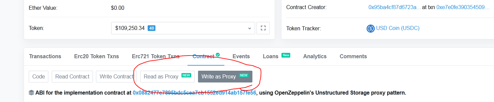

# Ejecuciones Exitosas de funciones que no estan en el ABI de un Contrato
Si una función está ausente en un contrato, no es necesariamente imposible ejecutarla
- Nota Especial: Minutos despues de empezar a trabajar con esta nota, [Etherscan](https://etherscan.io/address/0xa0b86991c6218b36c1d19d4a2e9eb0ce3606eb48#code) acaba de incluir las funciones de

 `Read as Proxy`
 y 
 `Write as Proxy`
 

